# CLI Architecture

This document describes the Happier CLI (`apps/cli`) and its daemon. The CLI is both an interactive tool and a background session manager that keeps machine state in sync with the server.

## System overview

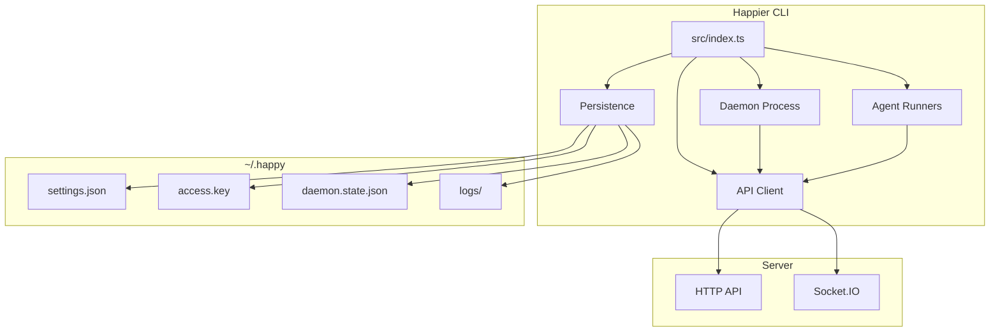

## High-level layout
- **Entry point:** `src/index.ts` parses subcommands and routes execution.
- **API client:** `src/api` handles HTTP + Socket.IO, encryption, and RPC.
- **Daemon:** `src/daemon` runs in the background, spawns sessions, and maintains machine state.
- **Persistence/config:** `src/persistence.ts` + `src/configuration.ts` manage local state in `~/.happy`.
- **Agents:** `src/agent/catalog` projects agent commands from bundled plugin contributions; agent-specific runtime code lives behind catalog entries instead of top-level `src/<agent>` trees.
- **Model Providers:** `src/providers` owns provider-neutral connection resolution, catalog assembly, probing, credential materialization, local discovery, and launch continuity. `src/cli/commands/providers` is the CLI adapter over those owners; it must not become a second settings or mutation implementation.

Executable Agents and model Providers are different domains. `happier agents ...` manages Agent runtimes; `happier providers ...` manages configured model-source connections. Provider contributions, connections, grants, settings, and structured model selections are protocol-owned. See [Providers](./providers.md) for the complete ownership and safety contract.

## CLI entry flow

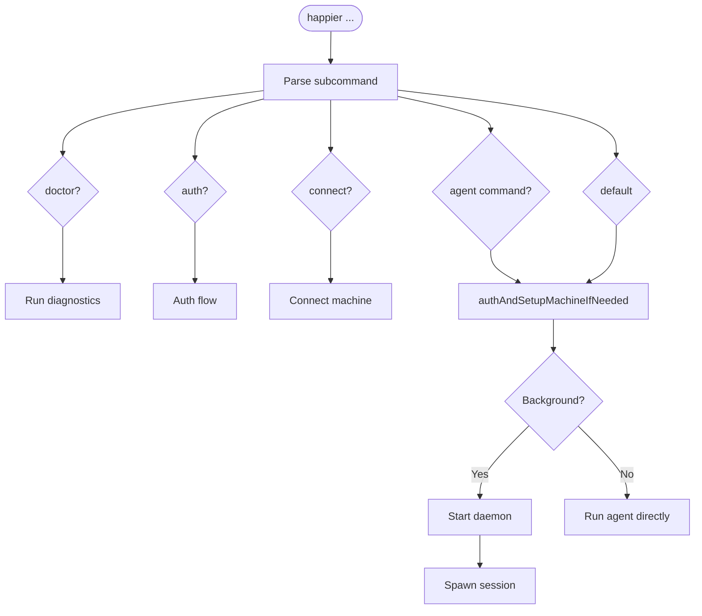

`src/index.ts` is the CLI router. It:
- Parses subcommands (`doctor`, `auth`, `connect`, plugin-projected agent commands, and default run flows).
- Ensures auth and machine setup when needed (`authAndSetupMachineIfNeeded`).
- Starts the daemon or runs an agent directly based on subcommand/context.

### Action-derived command arguments

An Action-backed command must not own a second description of the input the
Action already defines. The ownership boundary is:

| Fact | Owner |
| --- | --- |
| Meaning and validation of Action input | `packages/protocol/src/actions/actionSpecs.ts` schema |
| Field title, widget, choices, dynamic option source | `ActionInputHints` |
| Friendly command path, positionals, flag aliases, caller-shape binder | non-serialized `ActionSpec.cli` (`actionCliProjection.ts`) |
| Argv mechanics, global flags, TTY layout, JSON envelope | CLI |

`ActionSpec.cli` is deliberately excluded from `serializeActionSpec` and
`ActionDefinitionV1`: friendly paths and binder functions describe one packaged
binary, not a cross-version wire contract. Remote discovery publishes the canonical
JSON schema and hints needed to compile an equivalent field grammar without
shipping executable binders.

`apps/cli/src/cli/actions/` compiles those declarations into one descriptor per
friendly path. Parsing (`parseCommandInput.ts`), help (`commandHelp.ts`) and
completion (`commandCompletion.ts`) all read that same object, so a flag cannot
exist in help or completion without existing in the parser. `compileActionCliFields`
supplies the same field derivation to `happier actions invoke <action-id>`, which
therefore accepts ordinary `--field value` flags while retaining
`--<field>-json` and `--input-json` for nested or scripted input. A contributed
Action is first discovered through `action.spec.get`, then compiled from that
strict definition through the same field owner; only a Home that explicitly does
not support definition discovery receives the legacy JSON-only fallback. A denied,
malformed, or mismatched definition never falls back to looser parsing.

Input precedence has one rule: `--input-json` supplies the base object, distinct
field flags and positionals overlay it, and a second source for the same field is
rejected in either order rather than silently winning.

The same compiler owns the one-shot execution-run lifecycle commands (`list`,
`get`, `start`, `stop`, `wait`, and bounded stream `start`/`read`/`cancel`).
Their friendly `--agent`, `--intent`, permission, retention, class, and I/O
flags bind into the canonical `execution.run.*` Action schemas; there is no
separate CLI-only `--backend` interpretation or hand-written lifecycle parser.
The multi-step `session run action` workflow remains dedicated because it
selects and invokes another Action dynamically.

The development Workflow command family follows the same rule. All 17
`workflow.*` paths are `ActionSpec.cli` projections compiled by
`apps/cli/src/cli/actions/`; there is no Workflow-specific parser or transport.
Nested definitions and sources use the ordinary JSON-field grammar, opaque
cursors remain strings, and decimal-string wire values are never coerced to
JavaScript numbers. `--machine-id` routes `workflow.run.start`; it is not added
to that Action's strict input.

The Agent/MCP catalog derives the direct `workflow_run_start`,
`workflow_run_get`, `workflow_run_wait`, and `workflow_run_cancel` tools from
those same Action bindings. All other Workflow operations remain discoverable
through generic Action discovery/execution, with the same policy and errors.

Friendly Session commands resolve an ID, unambiguous prefix, or tag once at the
CLI transport boundary and pass the resulting exact Session ID to both Action
execution and presentation. A missing or ambiguous selector returns its typed
failure (including candidates where applicable); it is never retried against a
different Home, Session, Machine, or Run. A global `--server <saved-home>` (or
the documented explicit URL compatibility flags) selects the Home before
credentials and command dependencies are constructed. Action-derived commands
that support local selection also accept `--server-id <saved-home>`; both paths
resolve the same qualified Home identity, credentials, and endpoint as one tuple
for the invocation.

`createAccountServerActionDeps` makes that tuple structural: `serverId` and
`serverHttpBaseUrl` form one `AccountServerActionFixedHome` value that is either
wholly absent (follow the process default) or wholly present, and an incomplete
pair fails construction with `fixed_action_server_target_incomplete` rather than
combining one Home's identity with another Home's URL. Once an executor or
long-lived dependency (MCP servers, the daemon, a `--server-id` invocation) has
captured that pair, it keeps both halves for its whole lifetime: a later change
to the focused or active Home cannot retarget it, and a fixed URL never borrows
`configuration.activeServerId` after construction. A locally saved profile id is
routing identity only — external invocation authority still compares the explicit
`serverIdentityId`.

`--json` is CLI-owned and produces the standard single success/failure envelope
with a stable `kind` and `error.code`. `--` ends option parsing: later tokens
such as `--help` and `--json` are Action positional bytes, not CLI controls.
Shell completion is generated from the same admitted descriptors. Static paths,
flags, aliases, and enum choices therefore cannot drift from parsing; dynamic
choices use the canonical `action.options.resolve` Action and degrade to static
completion when authentication, connectivity, or the option source is absent.

Interactive CLI execution always supplies `present_user` authority explicitly;
it never inherits the executor's automation default. Discussion reads and Agent
posting remain usable by Account automation, while create, rename, archive,
restore, and personal read-state mutation are interactive UI/CLI operations.
Those interactive-only operations remain real user features but are omitted from
PAT/public-SDK and host-stamped plugin catalogs whose principals cannot satisfy
`present_user`.

The Action-owned command roots — `teams`, `identity`, `credentials`, `secrets`,
and `workflow` — are registered in `commandRegistry.ts` alongside the static,
Agent, and trusted-plugin roots, and `ACTION_CLI_ROOT_HELP` supplies their
`happier --help` lines. Root help, nested `--help`, completion, and dispatch all
read that one registration plus the compiled descriptors, so none of them can
disagree about whether a family exists: no valid command sits behind a root the
user has to guess. Trusted externally installed and bundled plugin commands use
the same Action-derived field compiler and host authority; neither receives a
private parser or capability path.

An ordinary `hap_v1` API Token may cross the existing one-shot child/tmux
continuation. A compound `hapc_v1` credential contains process-local wrapping
material and is rejected before any child is spawned rather than reduced to its
bearer. Whole-Action protected transport remains an in-process SDK capability.

Genuinely local, interactive, streaming and multi-step commands — authentication,
installation, daemon lifecycle, transcript follow, provider configuration — stay
dedicated. They are not turned into synthetic Actions.

Session input addressed to a Session-owned execution run is not a separate
command family: `happier send <session> <message> --run <run>` is the ordinary
send command with one optional destination, and `happier session run send` is a
deprecated compatibility argv alias over the same `session.message.send`
invocation and its result. Omitting `--run` constructs no recipient. The CLI runs
no capability preflight for a targeted send and never strips the recipient to
retry into the parent Session; the canonical Session-input owner returns the typed
refusal. `execution.run.send` remains the detached-run Action, and it requires
explicit `sessionId: null` rather than accepting either scope.

The refusals the CLI presents for a targeted send are the canonical admission
codes, not CLI inventions: `session_input_target_update_required` when this
server, this exact target Machine's `sessionInputAdmission` revision, or the
nested execution-run pending resource cannot carry the target (no row is
created), and `session_input_target_unavailable` when the daemon's Execution Run
registry positively proves the target cannot accept input. Both are members of
`SESSION_INPUT_ADMISSION_REJECTION_CODES_V1` and reach `--json` unchanged in
`error.code`. `--wait` on a targeted send observes only that admitted turn, so a
lost correlation surfaces the canonical `outcomeUnknown` result with its
`localId` retained instead of a codeless failure. See
[Pending delivery architecture](pending-delivery.md#execution-run-targets) for
the queued/blocked lifecycle behind those codes.

## Local state and configuration

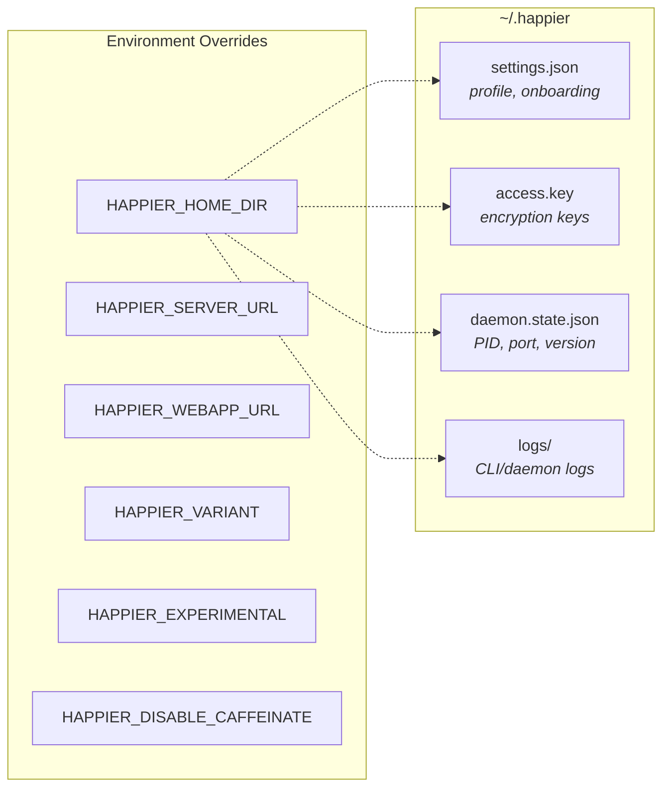

Local state lives under `~/.happier` (or `HAPPIER_HOME_DIR`):
- `settings.json`: onboarding and profile settings (validated/migrated).
- `access.key`: local key material for encryption/auth.
- `daemon.state.json`: daemon PID + control port + version.
- `logs/`: CLI/daemon logs.

Configuration lives in `src/configuration.ts`:
- `HAPPIER_SERVER_URL` and `HAPPIER_WEBAPP_URL` override defaults.
- `HAPPIER_VARIANT`, `HAPPIER_EXPERIMENTAL`, `HAPPIER_DISABLE_CAFFEINATE` control behavior.

## API client architecture

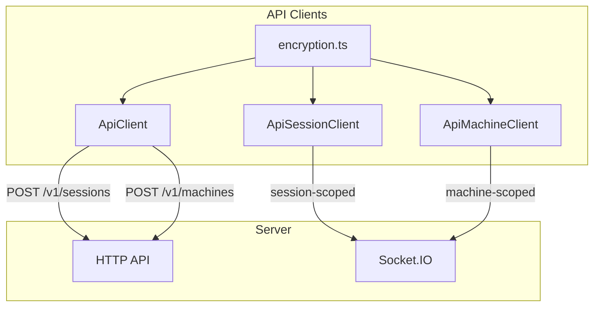

### HTTP
`ApiClient` (`src/api/api.ts`) handles:
- Session creation (`POST /v1/sessions`) with mode-compatible metadata/state.
- Machine registration (`POST /v1/machines`) with mode-compatible metadata/daemon
  state.
- Other CRUD actions through `ApiSessionClient` and `ApiMachineClient`.

### WebSocket

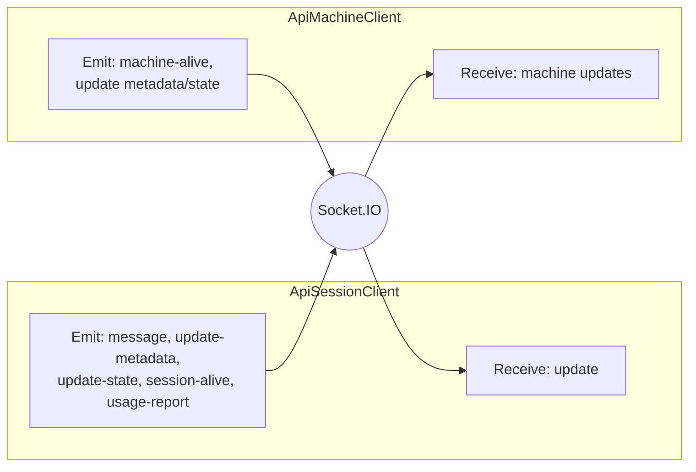

`ApiSessionClient` (`src/api/session/sessionClient.ts`) connects to Socket.IO as a **session-scoped** client:
- Receives `update` events and parses the Session's explicit plain/encrypted message
  representation, decrypting only the E2EE branch.
- Emits `message`, `update-metadata`, `update-state`, `session-alive`, and `usage-report`.

#### Session metadata authority

`ApiSessionClient` takes explicit metadata authority and transport dependencies.
The transport supplies the Home URL, Session socket factory, and optional Account
updates socket and token refresh. `ApiClient.sessionSyncClient` composes the
ordinary Account transport, preserving AccessKey provisioning. Restricted runtime
composition supplies its exact Session transport without that provisioning path.
Session HTTP operations retain the injected Home even if the process changes its
active Home. These dependencies are development architecture. The restricted
Runner now has a pre-Session, content-free credential-selection/readiness producer,
but the feature remains default-off and is not an availability claim while the
composed Runner, broker, native-host, and release gates remain open.

The metadata authorities are:

- `{ kind: 'owner', credentials }` — the ordinary CLI/daemon composition. It
  opens and reseals the layout-1 owner envelope, writes owner Agent state,
  converges Account settings, and joins the Account-wide user-scoped socket.
- `{ kind: 'shared_editor' }` — a restricted Session-runtime composition that
  holds only the Session data key and a Session-scoped runtime token. It writes
  the shared projection through the server's `shared_editor` tuple mode, never
  reads stored Account credentials, never refreshes its token from Account
  storage, and does not open the Account-wide user-scoped socket. Owner-only
  operations (owner Agent state, current-publisher metadata,
  Session user-input admission, Account settings) fail with
  `session_owner_authority_required` before any effect.

A shared editor may only write the fields the canonical
`SessionSharedMetadataV1` schema admits (`summary`, `agentPresentation`,
`externalSessionOperationPresentationV1`, `publicAgentState`); owner-only fields
are refused by that schema instead of being dropped. Scoped reconnects recover
through the exact Session transcript and snapshot owners without reading an
Account profile or Account changes cursor.

`ApiMachineClient` (`src/api/apiMachine.ts`) connects as a **machine-scoped** client:
- Sends `machine-alive` heartbeats.
- Updates machine metadata/daemon state with optimistic concurrency.
- Receives machine updates and merges them locally.

### Encryption

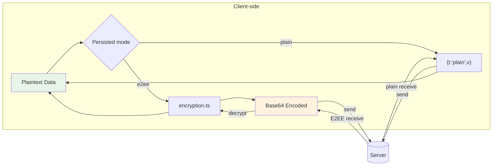

The CLI enters `src/api/encryption.ts` only for persisted E2EE content with real
matching material.
- Plain Session, Machine, Artifact, and domain-owned KV values use their strict plain
  representations and are intentionally server-readable.
- A token-only credential has zero Account E2EE material. Device-local keys may seal
  local secrets but are never uploaded or substituted for Account material.
- Some plain and encrypted values use base64 on byte-oriented routes; base64 is an
  encoding, not an encryption claim. See `encryption.md`.

## Daemon architecture

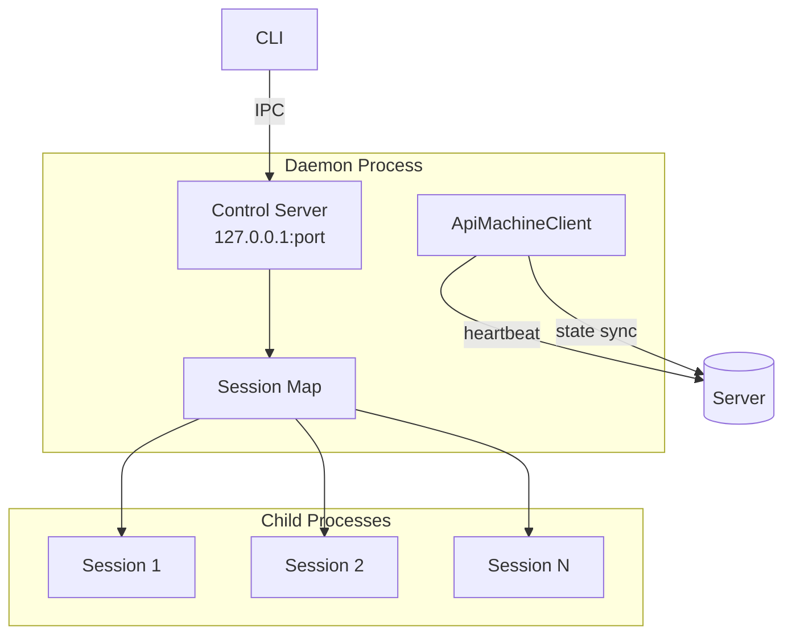

The daemon is a long-lived process responsible for running sessions in the background and maintaining machine presence.

### Lifecycle

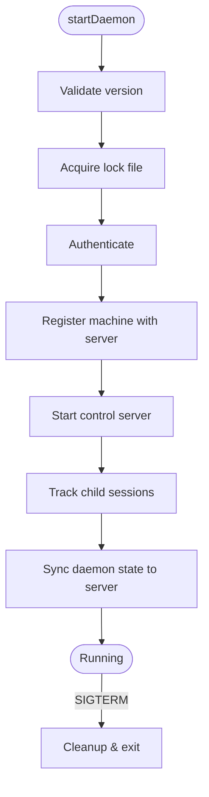

1. `startDaemon()` validates the running version and acquires a lock file.
2. It authenticates and registers the machine with the server.
3. It starts a local **control server** for IPC.
4. It keeps a map of tracked child sessions and updates daemon state on the server.

In current development, `createOnChildExited` releases session-marker evidence only
through the tracked exit lifecycle. An exit notification for an untracked PID does
not authorize marker deletion. Failed terminal-exit staging retains tracking and
marker evidence; visible-console startup awaits that cleanup and reports an
incomplete retirement rather than allowing its rejection to escape.

### Model-capacity recovery (development)

`ConnectedServiceTemporaryThrottleRetryScheduler` owns scheduling after a terminal capacity failure.
The Codex adapter reports that terminal failure to host recovery without an extra
immediate retry; native Codex retry-in-progress notifications remain nonterminal.
Consecutive capacity failures wait 5, 10, 20, 40, 80, 160, then 300 seconds before
jitter of ±20%. Provider retry/reset timing is a minimum, not a replacement for
the backoff. The delay is capped, not the number of attempts.

The capacity streak survives continuation handoff. Pending acceptance, a new turn
id, or reconnection is not evidence of model recovery. Only an accepted completed
turn resets the streak. A handed-off continuation has no second retry timer while
its outcome is pending; user cancellation remains authoritative. Authentication,
quota, and non-capacity transport recovery retain their own classifications and
policies.

### Control server (local IPC)

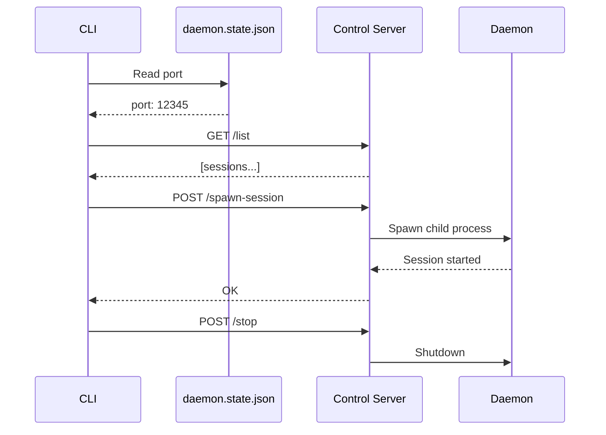

`startDaemonControlServer()` (`src/daemon/controlServer.ts`) runs an HTTP server on `127.0.0.1` and exposes:
- `/list` (list active sessions)
- `/stop-session`
- `/spawn-session`
- `/stop` (shutdown daemon)
- `/session-started` (session self-report)

The CLI talks to this server via `controlClient.ts`, using a port stored in `daemon.state.json`.

### Session spawning

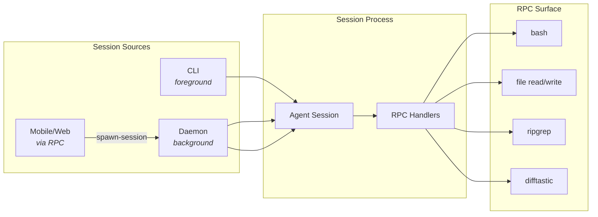

Sessions can be started by:
- The CLI directly (foreground).
- The daemon (background).
- Remote requests over RPC (from mobile/web via machine connection).

Daemon session spawning uses `registerCommonHandlers` to expose a controlled RPC surface (shell commands, file operations, search/diff helpers).

#### Initial access travels with fresh creation

The development collaboration transport carries the strict Protocol
`initialAccess` draft from Session authoring through `session.spawn_new` and
`createSpawnedSession`. `primaryTeamId` travels separately as fresh Team context;
neither field belongs to immutable creation correspondence or Session metadata.

The daemon places the access draft in a protected, one-shot local file using the
shared platform protection owner. Only its path travels in the private
`--session-initial-access-file-v1` runner flag. The CLI removes that flag from
Agent arguments and consumes and unlinks the file before Agent startup. The
daemon's launch-resource lifecycle retains failure and child-exit cleanup.
Tracked respawn options and persisted respawn descriptors do not retain access.

The host bootstrap and Replay-seeded HTTP creator send access and Team context as
top-level `POST /v1/sessions` fields. Replay attachment to the resulting Session
omits both fields. The HTTP creators use the shared collaboration feature
decision and preserve an explicit server update-required refusal; generic HTTP
errors are not treated as proof that creation had no effect. Recipient-envelope
construction and atomic grant application remain encryption/server concerns,
not transport-side or post-create sharing operations. This describes the
development transport, not release availability or completed live certification.

An exact initial-access `update_required` refusal uses the existing terminal
startup-failure webhook and spawn-nonce waiter. Protocol validates its operation,
reason, and component as a closed detail; both the immediate spawn response and
nonce recovery preserve it. The Action returns `update_required` with
`retryable: false`, rather than turning this no-effect refusal into a generic
failure or an unknown-outcome timeout. The outer daemon error remains
`SPAWN_VALIDATION_FAILED` for consumers that do not understand the added detail.

#### Pool resolution stays outside the daemon target

In the 0.3 development Machine Pools flow, the Home resolves
`machines.pools.resolve({ poolId, requestKey })` before session creation. The client
adds the captured Home `serverId` to the returned `machineId`, producing the existing
`SessionExecutionTargetV1 { serverId, machineId }`. From that boundary onward, CLI
and daemon spawning use the same exact-target checks and RPC route as a directly
selected Machine.

The daemon never receives a candidate list, priority policy, or retry instruction.
When the existing Machine-operation compatibility projection positively supports it,
current components may attach `{ kind: 'machine_pool', poolId }` as informational
`placementOrigin`; older supported daemons receive only the exact target. The origin
does not participate in dispatch, so there is no automatic reselection if exact
dispatch fails. Reopening a draft that already has an exact target, or using a source
Session shortcut, preserves that exact target and does not perform a fresh Pool
resolution unless the user explicitly selects a Pool again.

Pool administration and selection use the six generated Account Actions
`machines.pools.list/get/create/update/delete/resolve` against one explicitly
captured Home. Their canonical CLI spelling is compiled from the shared Action CLI
declarations as `happier machines pools <verb>`, so there is no hand-written
`happier pools` command family, no Pool-specific flag parser, and no second
repository or selection policy in the CLI host. The same
`machinePoolAction` family dependency serves the CLI, the daemon, and the MCP
servers through `createAccountServerActionDeps`. A Home that does not positively
advertise `machines.pools` retains ordinary exact-Machine commands and spawn
behavior; missing Pool support is not interpreted as an empty Pool or as
permission to try another Home.

Resolve failures remain before daemon dispatch. `empty`, `no_available_machine`,
and `presence_unavailable` leave the draft and its prior exact target intact so the
caller can refresh, pick a specific Machine, or deliberately select the Pool again.
Once daemon dispatch starts, its result is authoritative: transport ambiguity or an
offline selected Machine does not cause another resolve or another spawn.

Connected Service Pools are credential-source bindings and do not enter this flow.
Current 0.3 source can use a personal Machine Pool as a Team credential resource's
broker location. The source-owning daemons report content-free eligibility for the
currently available candidates, the Home applies the canonical selector once, and
the broker and restricted Runner paths continue with the selected exact Machine.
This remains development-only with loaded-Provider validation open. Capacity-aware
admission, Machine sharing, and Team-owned Pools remain deferred rather than removed.

### Machine state

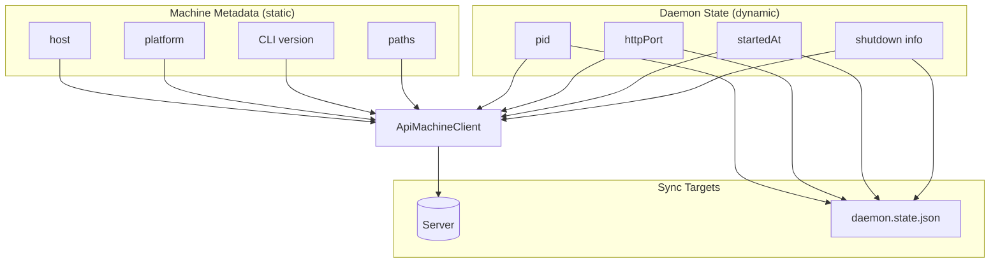

- **Machine metadata** is static info (host, platform, CLI version, paths).
- **Daemon state** is dynamic (pid, httpPort, startedAt, shutdown info).

The daemon updates these via `ApiMachineClient` and mirrors local state into `daemon.state.json` for control/diagnostics.

## RPC and tool bridge

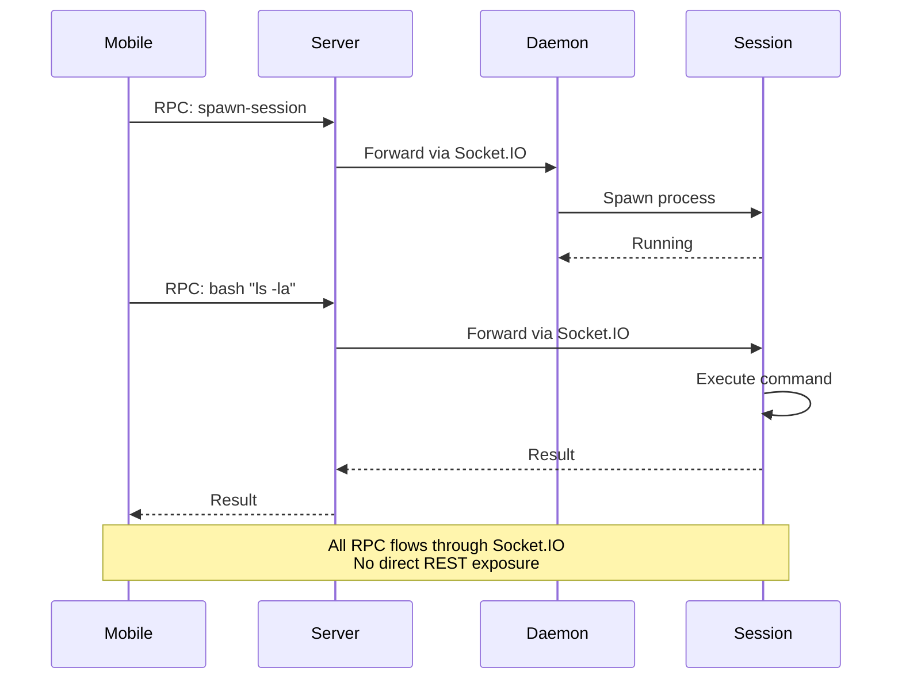

RPC is used to send commands over the Socket.IO connection:
- Sessions register RPC handlers (e.g., `bash`, file read/write, `ripgrep`, `difftastic`).
- The daemon registers a spawn-session handler so the server/mobile client can ask it to start a local session.

This mechanism allows the server and mobile clients to drive local actions without exposing a broad REST surface.

## Runtime-backed Stack and daemon artifacts

The CLI daemon is one component of the named-stack runtime format; it is not a second runtime owner. Source validation and source development use the checkout's workspace outputs; those workspace package outputs are distinct from managed runtime artifacts. A managed runtime build publishes daemon code and, when its inputs require it, an immutable daemon-support artifact for the CLI runtime dependencies, tools, and sidecars. The daemon manifest owns that optional support reference.

Managed server code follows the same boundary. Its generated Prisma/native runtime support is owned by the server component-artifact builder, while static web UI remains a separate selected runtime component. Stack launch supplies the selected UI path through `HAPPIER_SERVER_UI_DIR`; the server artifact does not decide which UI provider to use. Managed support references and snapshots are development/QA inputs only. Release/self-host packaging remains the existing per-target direct boundary that discovers and embeds each target's complete self-contained code/web/support payload; it does not consume or flatten a host-target managed snapshot.

Runtime snapshots are manifests plus managed references to canonical producer artifact payloads. A consumer selects the producer's current valid snapshot and retains only its own mutable state, process lifecycle, and selection pointer; it does not build or copy a payload. Snapshot validation checks component support references, and retention protects support artifacts transitively while a retained snapshot or external consumer selection needs them. Selecting a newer snapshot is non-disruptive: `selectedSnapshotId` can differ from `loadedSnapshotId` until an explicit restart, which is the proof boundary for newly loaded server or daemon bytes.

Generated bundled-plugin projections remain a source-tree publication concern. The projection publisher reads final serialized plugin artifacts and facts, prevalidates the complete small UI/Protocol projection set, stages changed leaves, and commits them through the existing mounted-tree transaction. Known-invalid input is rejected before replacement; a caught commit failure restores the touched tree to last green, and the next canonical preflight repairs an interrupted partial replacement. This is an observable-failure/next-preflight contract, not a generation pointer, journal, or power-loss atomicity guarantee across package-owned source trees.

The finite-task graph uses Turbo only as the outer dependency scheduler and read-only validation cache beneath `hstack-exec`. It is pinned through the current repository package manager; the later pnpm migration translates that ordinary development dependency rather than owning or delaying the task graph. Concurrency is set to 50% of the selected machine's logical processors, so a large development machine can use its capacity without imposing the same fixed process count on smaller CI or remote executors. Compiler-heavy inner schedulers remain separately bounded by their own memory profile.

Canonical build tasks do not pass through or restore from Turbo's cache. The root package-build command delegates its complete package set once to the existing workspace build owner, which already performs dependency-DAG scheduling, bounded concurrency, incremental/currentness checks, per-package locking, and atomic artifact publication. Package scripts remain directly runnable for focused diagnosis. Turbo is reserved for read-only source typechecks, API checks, tests, and projection checks whose exact-input results can be reused safely; CI restores job-scoped Turbo caches and Turbo revalidates the task hash before accepting them.

The repository typecheck reuses those canonical builds as the source-compilation evidence for buildable workspace packages. It then runs only the six remaining source-only graphs (Terminal Native, Plugin UI, App, CLI, Server, and the cross-package Tests workspace) with `--noEmit`. Their Turbo hashes include the exact emitted declaration roots they consume, rather than every workspace source tree. This avoids immediately compiling the same package a second time, avoids pulling all first-party Plugin builds into a typecheck, and still invalidates a cached source check when a consumed declaration changes. Plugin SDK and the external SDK retain separate test-project typechecks after their public declaration checks.

Generated-contract validation and mutable compiler-input preparation are separate finite facts. For example, the Plugin SDK Action-map and external SDK Action-wrapper checks are cacheable exact-input tasks, while synchronizing the physical declaration graph consumed by the Plugin SDK remains non-cacheable. This prevents an expensive semantic generator check from being repeated merely because declaration bytes must be refreshed through their canonical owner.

Incrementality is deliberately owned at the layer that can validate it. Canonical package builds retain compiler worktrees, build-info state, currentness fingerprints, and last-green `dist` outputs behind the workspace build owner. UI and Plugin UI source checks use their TypeScript build-info files; the remaining cold source/API programs use Turbo's exact-result cache rather than a long-lived compiler daemon. Plugin projection persists canonical serialized per-Plugin artifacts and reruns only affected Plugin checks before the aggregate comparison. A cache miss may therefore still construct a large TypeScript graph, but an unchanged candidate does not need to repeat it in the next local or CI invocation.

First-party plugin packages are discovered through the workspace glob and canonical bundled-plugin membership owner rather than an enumerated Turbo list. The canonical first-party template supplies the finite build/projection scripts, so a newly scaffolded package joins the same graph after the normal membership projection. First-party plugin build and projection remain separate tasks: the build always passes through the package owner, the read-only targeted projection check may be cached, and one non-cacheable aggregate check consumes the serialized artifacts. The workspace-derived Plugin test/typecheck runner uses a bounded two-package queue and still attempts every discovered package before reporting failures. The public `happier plugins dev` loop does not depend on Turbo and continues to own author-source watching, candidate preparation, reload, and diagnostics in standalone plugin repositories.

Live CLI dependency preparation also isolates Plugin build failures without serializing every healthy Plugin behind them: shared non-Plugin prerequisites build first, then up to two independent Plugin packages build concurrently through the same canonical workspace owner. Artifact publication keeps its fail-closed all-included-Plugins contract and delegates the complete Plugin set to that owner's own dependency-aware scheduler.

Broad unit, integration, database, and runtime suites are not automatically parallelized by the finite graph. Many launch their own Vitest workers or share databases, ports, Stack processes, simulators, or Docker resources. They stay with their existing owner until a focused pilot proves isolation and measures end-to-end benefit; adding another outer fan-out on top of their internal concurrency would otherwise trade a visible serial command for less predictable process and memory contention.

The source stack may start from a valid last-green runtime while changed source outputs refresh in the background. For the checkout-derived repository producer, `dev.mjs` schedules successful server/daemon reloads through the canonical runtime publisher, with one publication in flight plus one trailing identity recomputation; a full restart reconciles web, server, and daemon identities. Publication failure keeps the current snapshot selected and source services unchanged, and status is written through existing runtime state without restarting consumers. The detached Stack owner in `apps/stack/scripts/stack/run_script_with_stack_env.mjs` owns services and logs; the TUI attaches, displays the same state, and sends explicit controls. An unexpected TUI exit detaches from a healthy owner, while explicit quit/restart/stop retains the command's lifecycle semantics.

## Implementation references
- CLI entry: `apps/cli/src/index.ts`
- Daemon: `apps/cli/src/daemon`
- Control server/client: `apps/cli/src/daemon/controlServer.ts`, `apps/cli/src/daemon/controlClient.ts`
- API clients: `apps/cli/src/api`
- Persistence: `apps/cli/src/persistence.ts`
- Config: `apps/cli/src/configuration.ts`
