# Encryption and Data Encoding

This document details how plaintext and E2EE account/session data is represented, how
encrypted blobs are structured, and how those values map onto protocol fields. It is
based on the canonical mode-aware domain owners, `apps/cli/src/api/encryption.ts`, and
the server routes that accept/emit these values.

For transport and event shapes, see `protocol.md`. For HTTP endpoints, see `api.md`.

## Account-mode invariant

A plaintext Account is intentionally and genuinely keyless:

- its client credential contains a bearer token but no private recovery secret,
  Account machine key, Account content key, or other Account data-encryption
  material;
- clients must not fabricate, derive, or require replacement Account material for a
  plain path;
- server-readable account data, settings, and secrets use explicit
  `{ t: 'plain', v }` content envelopes and remain protected by authentication,
  authorization, recipient projection, and TLS;
- optional server at-rest sealing uses separate server-owned infrastructure. It does
  not create or require client Account material and is not client E2EE;
- device-only secrets use a device-local key and are never uploaded or reused as an
  Account key.

Persisted `Account.encryptionMode` is the sole Account-mode authority. Neither
`Account.publicKey === null` nor a non-null public key determines whether the Account
is plain or E2EE. Public verification anchors may be retained without granting
decryption capability or changing the persisted mode.

An Account persisted as E2EE must have the required signing and content public-key
bindings, and an E2EE value still requires real client E2EE material. Missing or
inconsistent bindings and unavailable material fail closed as a typed
locked/inconsistent/migration-required state while preserving the stored evidence.
They must never cause an E2EE Account or row to be reinterpreted as plain, create or
attach replacement keys, try plaintext after decryption fails, or return
empty/default content.

The development `GET /v1/account/encryption/currentness` response includes
`recipientEnvelopeReadiness`, projected by the server's
`deriveAccountRecipientEnvelopeReadinessFromRow` owner. It contains only
`{ status: 'available' }` or `{ status: 'unavailable', reason }`, never binding
material. Plain Accounts report `plain_account` even when they retain a valid
public binding. An E2EE signing anchor with both content-key binding fields absent
reports `encryption_setup_required`; partial or invalid bindings report
`encryption_inconsistent`. The latter two remain HTTP 400 `migration-required`
responses with no trusted currentness fields. Clients may consume that error's
readiness explanation for key-delivery UI, but must not treat it as successful
encryption-currentness admission. Missing or malformed readiness remains unknown,
not inferred from key presence. This endpoint is development-only; it is absent
from the inspected 0.2.11 stable/preview and current 0.2 predecessor contracts.

After the Account-mode decision, each persisted row or domain envelope remains
authoritative for its representation until the canonical transition owner rewrites
it. Callers must not infer mode from a token, credential shape, key presence,
decryptability, or a local fallback.

At every Account-scoped read and write boundary, the persisted Account mode and the
domain envelope kind must agree: plain uses `{ t: 'plain', v }`, and E2EE uses
`{ t: 'encrypted', c }`. A mismatch fails with the domain's typed
locked/inconsistent/migration-required result before content disclosure or mutation,
while preserving the stored value; it must not become absence, defaults, or a
fallback to the other branch.

### Terminology and rollout status

Older descriptions used **keyed** and **keyless** as shorthand for whether
`Account.publicKey` was present. That shorthand is superseded because authentication
credentials, Account mode, and the representation of an existing row are separate
facts:

- **token-only credential** means a bearer token with zero Account E2EE material;
- **E2EE credential** means a credential carrying real legacy or data-key material;
- `Account.encryptionMode` authorizes the representation of new account-scoped writes;
- an existing row's persisted representation remains authoritative until an explicit
  migration rewrites it.

Bearer-token, OAuth/OIDC, GitHub, or mTLS authentication is sufficient to authorize a
plain account. It does not create encryption material and must not be used to derive
any.

The repository is currently in an expand/migrate phase. Current source contains the
token-only credential shape, mode-aware domain readers, the stored-content caller
declaration, and the compatibility-fenced Session layout-1 path. Feature configuration
or schema/source presence alone is not proof that the complete token-only onboarding
flow has passed its mixed-version, persistence, composed, and platform checks.

The server's current advertised stored-content implementation is protocol `4`,
while protocol `2` remains the minimum compatibility floor for incumbent
stored-content operations. Current callers advertise the cumulative V4 contract,
which covers both the optional Session-access response witness and Account Settings
writers that preserve complete raw Profile rows, with
`x-happier-account-stored-content-protocol: 4` on HTTP and
`accountStoredContentCompatibility:{v:1,protocolVersion:4}` in Socket.IO auth.
A current client remains usable with a V3 server; a server without the additive
V4 capability omits the Session-access witness but can still accept the client's
opaque Settings writes.
The `/v1/features` discovery request remains header-free. Before discovery, current
clients send their implicit cumulative V4 declaration on ordinary requests so a cold
Settings restore is identified as profile-preserving; explicit operation declarations
remain unavailable until the server advertises support. Missing or malformed
declarations identify legacy callers; they do not reject the connection.
Operations that must read or write the current stored-content representation return a
typed `client-upgrade-required` result to a legacy caller, while operations that remain
safe without interpreting that representation continue to work. There is no operator
`observe`/`required` activation mode for account stored content.

Both `/v1/account/settings` and `/v2/account/settings` require the V4 writer
declaration before replacing the shared Settings document. The server does not inspect
the opaque body for Profile fields: released 0.2 writers normalize whole Profile rows
through an older closed schema and can erase V2 fields even during an otherwise
unrelated Settings write. Reads and unrelated operations remain available, and no
parallel Profile representation or dual writer is maintained.

The settled source boundary is green for genuine token-only OAuth/mTLS, the E2EE-only
Account cipher, corrupt local-key handling, the single UI Settings normalizer, Memory
Settings typed errors, Machine/Todo/Artifact fences and current producers, the global
declaration, Session layout 1 across Protocol/server/CLI/UI/runtime, the
Provider/MCP/Memory/resume/attach/prompt-Artifact consumers, and the final Connected
Services handoff, which reports 226 tests green. Current Protocol, Server, CLI, and UI
TypeScript 7 are green. These results do not by themselves close
mixed-version, live, database, two-client, daemon, or platform proof.
Account-transition amendment
`PLAINTEXT-ACCOUNTS-2026-07-30.7` is source-green at its Protocol, server, CLI, and
UI first-key owner/Settings/callback/storage boundaries. The UI retains one bounded,
server-scoped OAuth or mTLS continuation, expires it explicitly, stores the callback
pending handle before migration, and performs one exact retry from authoritative E2EE
Settings hydration without starting a new challenge. Credentials persist before
custody clears. The root-independent pre-provenance rerun is green at 40/40, and
direct UI TypeScript 7 is green. The final implementation now persists the strict
literal `migrationSubmissionAttempted?: true` marker with the pending handle before
the first migration POST; a failed custody write produces zero POSTs. Only a
definitive first-submission 4xx except 408/429 may clear custody. Ambiguous transport,
5xx, 408/429, commit-observed/post-persist failures, and every later failure retain
custody. The root-independent final rerun is green at 45/45, direct UI TypeScript 7 is
green, and the scoped diff check is green pre-gap evidence. The two source corrections
have since landed: first-key resume owns one exact POST per resume with hidden API
backoff disabled only for this path, and marked active-server mismatch retains custody
before rejection with zero POST/persist/clear while unmarked mismatch keeps prior
cleanup. Module-local mutation serialization and bounded primary→legacy→global lookup
close the stale-state race and legacy-reader omission; root-independent evidence is
67/67 including exact concurrency, direct UI TypeScript 7, and scoped diff green.
Cross-tab/worker serialization remains a platform residual. Approved amendment
`PLAINTEXT-ACCOUNTS-2026-07-31.8` closes the logout/account-replacement decision:
ordinary logout and different-token replacement must fail before credential or app
state mutation and route to **Finish encryption setup** while marked custody exists.
Successful same-token recovery keeps the user signed in for recovery-key backup/copy.
Only a separately confirmed destructive abandonment may exact-clear that marked
record before credentials are removed or replaced; its warning must state that E2EE
may already have committed and discarding the pending key may permanently lose
Account access. Token invalidation is not safe abandonment. Amendment `.9` is the
current approved contract and extends these `.8` outcomes. The
[canonical plaintext-accounts plan](../.project/plans/happier-plaintext-accounts-keyless-external-auth-and-account-data-envelopes-2026-02-23.md)
owns mutable execution status, exact source evidence, and open database/live/platform
gates. Source evidence described here does not by itself activate the feature.

### Key ownership

| Material | Plain account | E2EE account | Owner and purpose |
|---|---:|---:|---|
| Account E2EE material | absent | present | Client-side confidentiality for account-scoped E2EE content |
| Session data key | only for a retained E2EE Session | per E2EE Session | Session transcript/metadata confidentiality |
| Server at-rest key | optional | optional | Server-owned database/backup exposure reduction |
| Device-local key | present per device | present per device | Local secret/cache/daemon restart persistence |
| TLS/auth material | present | present | Transport and account authorization, never content-at-rest encryption |

### Device-local secret sealing

Device-local sealing is deliberately separate from account encryption:

- the CLI/daemon owns one private key file at
  `~/.happier/device-local-secret-key.json`;
- the file is created once with publish-if-absent semantics so concurrent daemon
  startup cannot replace another process's key;
- protection is applied by one owner,
  `apps/cli/src/utils/fs/protectedLocalState.ts`, for every private local file the
  CLI/daemon writes — device-local key, bearer credentials, capability file,
  machine-local records alike. POSIX installations enforce a private parent
  (owner-owned, no `0077` bits) and a `0600` file mode; Windows cannot express a
  POSIX mode, so it applies and then verifies a protected DACL (inheritance
  disabled, owner plus `LOCAL SYSTEM`, full control, no reparse point) through
  `packages/cli-common/src/fs/windowsProtectedAcl.ts`. A Windows install where that
  DACL cannot be proven fails closed rather than publishing an unprotected file;
- the key is 32 random bytes and is never derived from a bearer token, account key,
  installation signing identity, Machine identity, or server response;
- local secret payloads use AES-256-GCM with a random 12-byte nonce and
  `session_respawn_environment` purpose-bound AAD;
- opaque local identities use HMAC-SHA-256 with the same device-local key and the
  distinct `external_session_transcript_refresh_cursor` purpose; this hides the raw
  Agent cursor without turning it into an Account identity or uploading the key;
- local Memory settings secrets use a 32-byte key derived from the same device-local
  root with HMAC-SHA-256 and the distinct `memory_settings_secrets` derived-key
  purpose. Current CLI writes seal with that derived device key; reads also accept
  supported legacy credential-derived keys for compatibility. The derived key is
  neither Account material nor portable cross-device custody;
- daemon Memory indexes contain plaintext derived summaries, transcript chunks, and
  embeddings. Their root directory and SQLite main/WAL/SHM files use the same
  protected-local-state owner before sensitive rows are written; SQLite sidecars
  created later inherit from that protected root. An unsafe or symbolic-link root
  is rejected rather than used;
- corrupt or missing ciphertext fails closed. A corrupt existing key file is never
  silently replaced, because doing so would make all prior local ciphertext
  permanently unreadable without explaining the loss.

New daemon respawn descriptors use `device_local_v1`. The existing
`account_scoped_v1` descriptor remains a read-only compatibility shape for markers
written by the supported predecessor. Canonical writers do not dual-write both
representations, and the compatibility reader can be removed once those markers are
no longer reachable.

Device-local sealing protects files on that device. It does not turn plaintext
account data into E2EE data, does not make local data portable to another device, and
must never be uploaded as an account recovery mechanism.

The secure External Session transcript-refresh path reads the existing
`StoredCredentials` union and requires the daemon to inject this device-local custody
explicitly. It has no Account-key/HMAC fallback and no second local secret store.

### Machine-local Agent native-resume records

Same-Session Agent transition can return to an Agent used earlier in the same Session by resuming
that Agent's own native session. The record holds the Agent's own conversation id and the transcript
seq it last saw (`{ v, vendorResumeId }` plus `departureSeqInclusive`) — **not a continuity proof**;
the proof mechanism was removed, so there is no pre-check, no `stat()` and no liveness probe. It is
machine-local because a vendor session on one machine cannot be resumed on another, and it is
deliberately kept off the wire. It is machine-local state, not Account data.

`apps/cli/src/session/handoff/metadata/localSessionHandoffMetadataStore.ts` owns the record:

- path `<activeServerDir>/session-handoff/agent-native-resume/<hash>.json`, where `<hash>` is
  SHA-256 over a domain-separated tuple (`happier.local-agent-native-resume.v1`, Session id, Agent
  id). Filenames therefore disclose neither the Session nor the Agent, and the plaintext keys inside
  the record are re-verified against the request before it is used;
- written and read through `writeProtectedLocalStateFileAtomic` /
  `readProtectedLocalStateFile` (`apps/cli/src/utils/fs/protectedLocalState.ts`): directories `0700`,
  files `0600`, forbidden bits `0077`, and an atomic tmp+rename replace whose verification is of the
  path's permissions, not a content read-back. `writeAgentNativeResumeRecord` returns `void`: every
  read `safeParse`s, so a partial file already reads as absent and a read-back could only restate
  that;
- a corrupt or unreadable record resolves to `null` and the target Agent starts fresh. It is never
  silently rewritten;
- the record is **not** discarded when the target Agent starts. A discard was not observable and was
  not garbage collection either, since nothing sweeps the directory; a later departure overwrites the
  record instead. Orphaned records after Session deletion are a disclosed residual — no Session-delete
  signal reaches this store.

This is file protection on one machine, in the same sense as device-local sealing above: it is not
Account material, it is not portable to another device, it is never uploaded, and it confers no
account-scoped confidentiality. It is distinct from device-local *sealing* — the record's contents
are not encrypted with the device-local key; its protection is filesystem permissions plus a
non-identifying filename. Do not promote it to an Account-scoped identity or reuse it as a recovery
mechanism.

`../0.2` has the same device-local record in
`apps/cli/src/session/handoff/metadata/localAgentNativeResumeRecordStore.ts`. Its dedicated module
and dev's combined metadata store are a file-layout difference only: both use the same protected
path/strict stored shape and byte-compatible record. The record never crosses the wire, so a return
on a different machine still starts fresh with full bounded context.

## Overview

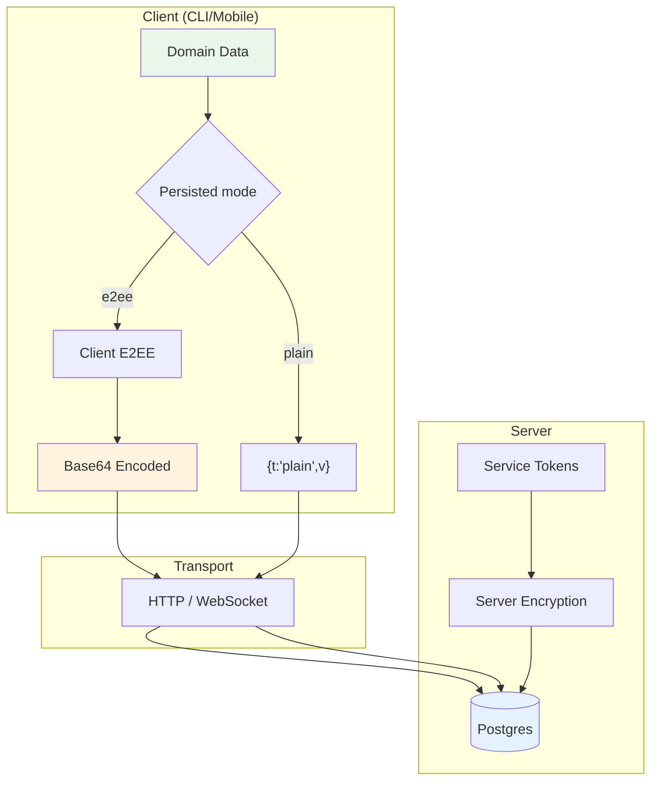

## Design goals
- Keep the server blind to E2EE content.
- Keep plaintext accounts genuinely keyless and server-readable by explicit user/server
  policy.
- Use explicit, stable binary layouts so clients can interoperate across versions.
- Prefer simple, consistent base64 encoding on the wire.
- Keep account, Session, server-at-rest, device-local, and transport key ownership
  separate.

## Encryption variants

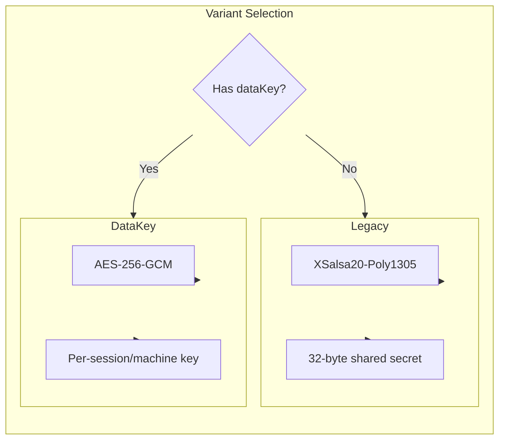

E2EE branches currently use one of two encryption variants. Plain branches do not
choose either variant and do not enter the Account cipher.

### 1) legacy (NaCl secretbox)
Used when the client only has a shared secret key.

**Algorithm**: `tweetnacl.secretbox` (XSalsa20-Poly1305)
- **Nonce length**: 24 bytes
- **Key length**: 32 bytes

**Binary layout** (plaintext JSON -> bytes):
```
[ nonce (24) | ciphertext+auth (secretbox output) ]
```

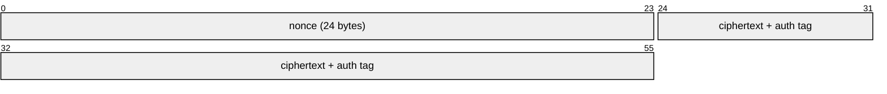

### 2) dataKey (AES-256-GCM)
Used when the client supports per-session/per-machine data keys.

**Algorithm**: AES-256-GCM
- **Nonce length**: 12 bytes
- **Auth tag**: 16 bytes
- **Key length**: 32 bytes

**Binary layout**:
```
[ version (1) | nonce (12) | ciphertext (...) | authTag (16) ]
```

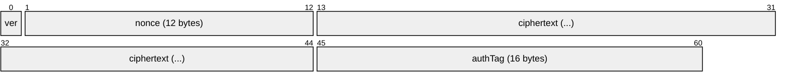

- `version` is currently `0`.

## Data encryption key (dataKey variant)

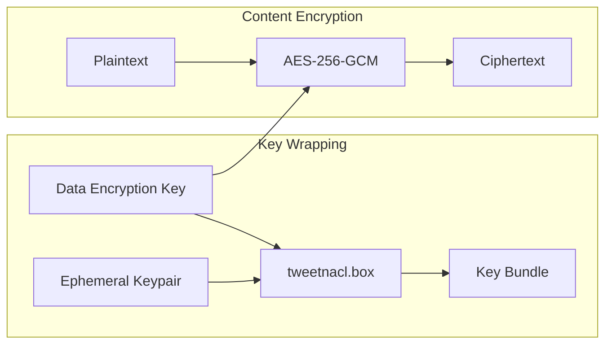

When `dataKey` is used, the actual content key is encrypted for storage/transport.

**Algorithm**: `tweetnacl.box` with an ephemeral keypair.
- **Ephemeral public key**: 32 bytes
- **Nonce**: 24 bytes

**Binary layout**:
```
[ ephPublicKey (32) | nonce (24) | ciphertext (...) ]
```

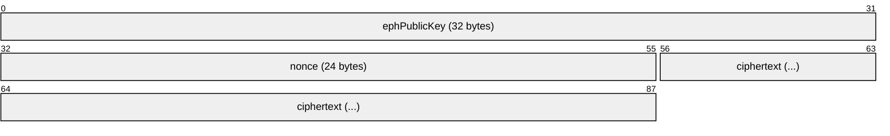

This blob is then wrapped with a version byte before being sent/stored:
```
[ version (1 = 0) | boxBundle (...) ]
```

The resulting bytes are base64-encoded and placed in fields such as `dataEncryptionKey` for sessions/machines/artifacts.

The fixed data-key envelope is exactly 105 bytes — version `0`, a 32-byte ephemeral
public key, a 24-byte nonce, a 16-byte tag, and the wrapped 32-byte data key — which is
140 characters of padded Base64. `crypto/encryptedDataKeyEnvelopeV1.ts` is the sole
codec for it; `crypto/boxBundle.ts` stays a generic variable-length box and never
acquires 32-byte semantics.

Those sizes are owned by pure format leaves that import no crypto implementation:
`crypto/boxBundleFormat.ts`, `crypto/encryptedDataKeyEnvelopeFormatV1.ts`, and
`crypto/accountContentKeyBindingFormatV1.ts`. Wire schemas admit an envelope or a
transported content-key binding by importing those constants, so a schema reachable
from the public SDK's browser surface does not pull the seal/open codec's
Node-reachable dependency graph in behind it. The codecs consume and re-export the same
constants, so a producer and a validator cannot disagree about a released size.

### Account recipient bindings (development)

`crypto/accountContentKeyBindingV1.ts` owns the shared Protocol signer and verifier.
It preserves the existing signed bytes: UTF-8 `Happy content key v1`, one NUL byte,
then the raw content public key. Verification rejects malformed or low-order content
keys and invalid signatures, returns copied binding bytes, and uses the existing
content-public-key fingerprint owner. Server admission still owns initialization,
immutability, persistence, and Account encryption currentness.

A verified signature binds the content key to the supplied Account signing key.
It does not independently authenticate that signing key when an unpinned Home lookup
can substitute the whole binding. This preserves the existing Account trust boundary;
it does not establish cross-user key transparency or out-of-band verification.

That distinction keeps protected SDK delivery to a restricted Runner fail-closed.
The current bootstrap cannot use a signing key returned by the Home to authenticate
a Runner Machine envelope claimed by that same Home. The ordinary authorized
Account-daemon carrier remains the implemented development path; restricted-Runner
activation requires an independently authenticated key producer and verification
lifecycle before it can be documented as available.

The development server's `accountRecipientEnvelopeReadiness.ts` derives recipient
readiness from that Account currentness owner. Healthy Plain Accounts remain unavailable
for recipient wrapping even with a retained public binding. A valid E2EE signing anchor
with both content-binding fields absent needs encryption setup; partial or invalid
bindings need repair. Complete verified E2EE bindings are available for wrapping.
Account status and Session access must be checked separately before disclosing this
projection. These owners alone do not establish completion of the Session-envelope
persistence or sharing-flow cutover.

The authenticated exact-user response used by trusted direct-grant hosts carries this
same readiness decision alongside the already-published binding. The current UI and
CLI hosts branch on that projection before sealing: authoritative unavailable recipients
receive key-free logical grants and remain locked with their original setup or repair
reason. Only `available` recipients have their binding verified and used; a malformed
projection, invalid available binding, or failed lookup is not setup-pending readiness.
Broad friend/search projections do not acquire a
second readiness decision. The physical grant transaction still re-reads the Account
row and applies the same server owner, so the projection is preparation input rather
than authorization or a client-owned currentness claim.

Access revocation cannot recall a disclosed content key. Retained keys can open any
ciphertext subsequently obtained under those keys, including content the former member
had not previously opened. Current authorization must therefore gate future retrieval;
removing access is not cryptographic revocation.

### Optional API credential content material (development)

The development Protocol implements `wrapApiTokenEncryptionAccessV1` and
`openApiTokenEncryptionAccessV1` in `packages/protocol/src/crypto/apiTokenEncryptionAccess.ts`.
Trusted UI and CLI issuance consume those byte owners through the existing
API-token lifecycle, and the public SDK consumes the resulting compound
credential through whole-Action protected transport. This is development-source
behavior; a loaded SDK journey through direct-daemon and Home-relay origins has
not yet been certified, and release validation remains separate evidence.

The wrapper encrypts exactly the Account's 32-byte content private key, using a separate
32-byte local wrapping secret. The existing `deriveKey` owner binds the wrapping key to
`Happier API token content wrap` and the ordered path
`[v1, serverIdentityId, accountId, tokenId, contentPublicKey]`. The stored Base64url payload
contains a 24-byte nonce followed by the authenticated secretbox ciphertext: 72 bytes total.
It uses the strict record in `auth/accountApiTokens.ts`, not the Session recipient-box format.

Opening requires locally pinned Home, Account, token, and content-public-key context.
After authenticated decryption, the existing Account material validator checks the recovered
private/public pair. Invalid records, mismatched context, wrong secrets, and failed key-pair
validation return no material. Issuance owns Account mode/currentness checks; these crypto
helpers neither authorize a caller nor initialize keys for a Plain Account.

The recovered key is Account-wide content capability, even though its wrapper is token-bound.
It does not export the recovery/signing secret or make recovery-secret-only historical
ciphertext readable. Token revocation cannot recall a content key already opened by a client;
it stops authorized token use rather than cryptographically revoking retained material.
Whole-Action request/result protection is a separate transport consumer of this material;
successful wrapping alone proves neither private transit nor SDK integration.
The current SDK path retrieves only the authenticated token's wrapper, validates
the pinned Home, Account, token and content public key, and encrypts the complete
Action request and complete result/error/approval envelope without a plaintext
fallback. It clears opened material when the client closes.
These are observed source mechanics and focused-test results, not proof of the
still-unrun composed live journey.

### Native password credential (0.3 development)

Native email/password authentication adds one server-persisted credential row per
Account (`AccountPasswordCredential`) beside the existing identity and encryption
owners. It never replaces them:

- `Account.encryptionMode` stays the sole Plain/E2EE authority, and every reader and
  writer parses the credential through one mode-qualified strict union
  (`packages/protocol/src/auth/accountPasswordCredential.ts`). A credential whose kind
  does not match the persisted mode fails closed before disclosure or mutation; it is
  never reinterpreted.
- A **Plain** Account keeps the credential `plain_password_hash`: a server-side scrypt
  record over the accepted password bytes within the OWASP-ladder parameter window.
  Plain Accounts remain genuinely keyless — the hash grants login, never encryption
  material, and no client or server may fabricate Account keys for them.
- An **E2EE** password is a local convenience wrapper around the *existing* 32-byte
  recovery secret. The client derives one password root with Argon2id13. The current
  development writer and reader admit the one implemented profile represented in
  code: three passes over a 64 MiB working set; no released or predecessor envelope
  requires a wider speculative range. The client derives domain-separated wrap and
  authentication keys from that root, seals the
  recovery secret with AES-256-GCM under canonical AAD that binds the envelope version,
  purpose, Account signing public key, and exact KDF/cipher parameters, and uploads only
  the envelope plus a one-way scrypt verifier over the derived authentication key.
  The Home never receives the password, the password root, or the wrap key.
- Login proves possession without disclosure: public prelogin returns only bounded KDF
  routing facts (a per-mailbox decoy drawn from the real writer-profile distribution, so
  absent Accounts stay indistinguishable); a rate-limited unlock boundary verifies the
  derived authentication key before releasing the real envelope and expected Account;
  authentication then reuses the existing Key Challenge V2 owner and the existing
  `{ token, secret }` credential shape.
- Password creation, change, reset, removal, and mode transitions mutate only the
  credential row (and the mode bit where applicable). They never re-encrypt Session or
  Account content, never alter signing or content keys, and never introduce a second
  recovery secret, recovery format, or disclosure surface. The recovery key remains the
  E2EE recovery authority; email alone cannot restore lost E2EE data.
- The live Account-mode transition remains the incumbent one-shot migration owner. When
  a password credential exists, its request carries the prepared target credential and
  exact source revision, never a raw password. Plain-to-E2EE consumes the current Plain
  password through the existing `email_password` external-auth proof carrier. E2EE-to-Plain
  consumes the existing password-mutation Key Challenge bound to both the target verifier
  and canonical migration digest. The finalizer replaces the credential and flips
  `Account.encryptionMode` in the same transaction; passwordless transitions keep their
  existing request. The independently gated staged V5 routes remain disabled.
- Both branches share one password-text acceptance contract: well-formed Unicode scalars
  only (unpaired surrogates rejected), a 15-scalar minimum, a 1024-UTF-8-byte ceiling,
  and no silent normalization, so every platform hashes the exact entered bytes.
- Trusted UI and CLI Account Security consumers share the Protocol-owned E2EE mutation
  builders. Each independently supplies the authenticated Account id and selected Home
  audience, verifies the prepared envelope and exact operation digest, and signs only
  after those checks. A mutation always runs inside an authenticated
  session on an already established Home, so that audience check is identity-bound: a
  challenge issued by a different `serverIdentityId` is refused, while a different issued
  origin is accepted, so one Home stays usable through every address it is reached at.
  First-contact login is stricter — see the key-challenge audience trust model in
  `docs/api.md`. The CLI owns only its platform KDF/HTTP adapter; it does not carry
  a second envelope, verifier, proof, or approval-bypass implementation.

## Where storage mode is applied

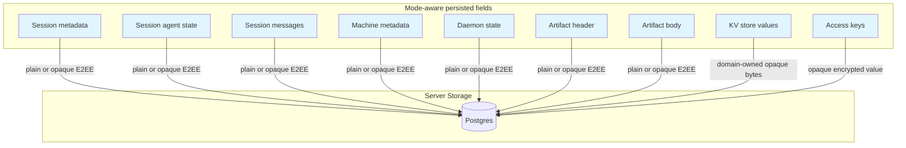

These fields are mode-aware. E2EE branches remain opaque ciphertext to the server.
Plain branches carry a strict stored-content envelope and may be sealed only inside the
server persistence layer.

### Session metadata + agent state
- E2EE Sessions are encrypted by the client.
- Layout-0 plain Sessions use explicit plain content.
- Layout-1 owner metadata uses one strict Session-specific stored-content envelope:
  `{ t:'plain', v:<strict owner metadata> }` for a genuinely keyless/plain Account or
  `{ t:'encrypted', c:<account-scoped ciphertext> }` for E2EE ownership. The plain
  branch requires no Account key; the encrypted branch requires real compatible
  material.
- Fresh layout-1 creation and owner-driven layout-0 migration activate only after the
  complete compatibility-declared Session/CPX writer, reader, tuple-CAS, and recipient
  projection vertical is green. Schema presence alone does not activate it.
- In current development source, `app/session/create` owns ordinary tag-based
  creation/rejoin and fresh creation at a reserved identity. Creation rechecks the
  active Account inside the transaction; Layout-1 also checks current encryption
  under the owner-metadata fence. The Session and its durable AccountChange commit
  together through `publishSessionCreationInTx`; socket wakes run only after commit.
  Rejoining an existing Session does not publish a second creation.
- Used in:
  - `POST /v1/sessions` (create/load)
  - WebSocket `update-metadata` / `update-state`
  - `update-session` events

### Session System Records in the UI

Current development source opens System Records according to the persisted
Session `encryptionMode`. Plain Sessions require `{t:'plain',v}`; E2EE Sessions
require `{t:'encrypted',c}` and the incumbent Session encryption context. Key
presence never selects the mode. A mismatched envelope fails closed.

The UI's `sync/encryption/sessionStoredContent.ts` owns these mechanics for both
persisted-Session drafts and System Records. The record codec under
`sync/domains/sessionSystemRecords` separately validates the exact address and
domain payload. Missing Session keys produce `locked`; an available context
that cannot open the bytes produces `corrupt_or_unopenable`. Neither means the
record is absent, and neither justifies interpreting encrypted bytes as plain.

The same domain owns the Account-scoped runtime repository used by workflow
activity and Board Actions. It retains last-known records during failed refreshes,
marks them stale on scoped Session/share AccountChanges, and retires cached data
with the owning Account lifetime. Its predecessor workflow adapter is read-only
and uses the same content codec without manufacturing record revisions.

Managed Workflow accepted snapshots, checkpoints, invocation progress, and final
results follow the same Account-mode authority. The server validates each outer
stored-content envelope against the persisted Account mode and stores or projects
only opaque bytes plus public indexes; it never opens private workflow content to
infer recovery safety. An authorized daemon or client opens the envelope with the
exact Run/record binding, validates the strict domain payload, and fails closed on
a mode mismatch, unavailable key material, or invalid binding.

Restore-workspace availability therefore has two distinct layers: the server may
advertise only coarse public eligibility, while the client requires opened private
`workspace_unavailable` progress with the recorded creation intent and checkout
descriptor. Neither ciphertext presence nor a server-visible Run state authorizes
a filesystem effect by itself.

#### Shared Board records (development)

The Board uses the existing Session System Record table and Session encryption
mode. Host-owned `surface/layout.v1/layout` and `surface/item.v1/<itemId>` records
belong to the Session owner's Account, including edits by collaborators. Record
identity uses namespace and local ID rather than kind, so the item-ID schema
reserves the exact value `layout` for the shared layout record.

`PUT /v2/sessions/:sessionId/board` composes the System Record owner's conditional
row operations in one transaction: creating an item includes its placement, and
removing an item includes its replacement layout. The transaction checks current
`editSessionRecords` capability and envelope/storage correspondence. Envelope
checks cover retained records as well as incoming writes; an inconsistent retained
envelope fails before mutation. Plain source
updates preserve their source class and installed-surface identity. The server
cannot inspect E2EE source semantics; authoring clients validate opened content
before sealing, and mounts must independently admit the current source.

Retries reuse the exact sealed request and expected revisions. Identical stored
envelopes can settle a retry; different ciphertext conflicts. A retried removal
settles only when its item is absent and its exact replacement layout remains
stored. A recreated item or a changed layout does not authorize the old removal.

The canonical `sessions.board` decision gates the mutation and exact surface
read/list paths. Generic record upsert/delete cannot mutate these typed-only
kinds; legacy host listings exclude them. Committed mutations publish only
`{v:1,sessionSurfaces:true}` through the existing Session recipient AccountChange
owner, with socket wakes after commit. This hint carries no Board content.

These are current development contracts. The composed Plain/E2EE client journeys
and provider validation remain release gates; source wiring alone does not prove
their availability in a deployed version.

Board organization is shared Session state, but presentation is not. The active
Board view and Companion selection, edge, density, and collapsed state remain
viewer/device-local; mounting or inspecting either surface does not create shared
records, Follow state, unread state, or attention. Board reads require the current
`readTranscript` capability. Every edit and editing affordance requires
`editSessionRecords`, including mutations requested through Actions; the Action
owner retains authentication, admission, confirmation, and approval policy.

Installed external and built-in plugins are equally trusted installed code. They
enter through the same public SDK and host-capability negotiation under equivalent
grants; built-in origin does not grant a second privileged Board path. A
caller-authored HTML document stored in a Board item is a different source class:
it has no plugin identity or ambient plugin authority and can request only the
bounded caller-hosted method ceiling (`context`, `watchContext`, `readResource`,
`watchResource`, `executeAction`, and `notify`). Each Resource and Action still
performs its ordinary authorization and approval checks. Current development UI
carries this caller-authored runtime through the shared frame implementation on
React Native web/Tauri, iOS, and Android. Per-realm loaded isolation and lifecycle
validation remains an activation requirement rather than a released support claim.
A client that cannot currently admit the renderer keeps the record visible with
truthful unsupported/recovery UI; unavailability never deletes or rewrites the
shared record.

#### Session discussions (development)

Discussion titles and message bodies use the same strict Session stored-content
outer envelope as System Records: Plain Sessions accept only `{t:'plain',v}` and
E2EE Sessions accept only `{t:'encrypted',c}`. The server checks the persisted
Session mode before reads or mutations and never falls back from an unavailable
E2EE key to plaintext. Inner title and message schemas remain discussion-owned.
The CLI's `sessionStoredContentCodec.ts` and the UI's Session stored-content codec
share Protocol conformance vectors for the outer envelope; Board/System Record and
Discussion callers do not choose storage mode independently.

The server can see discussion and message identifiers, sequence and archive state,
Account authorship, mention Account ids, timestamps, and Agent producer/run
provenance. It cannot read E2EE title or body content. Agent posts are admitted only
through the authenticated Session runtime carrier: public Account HTTP cannot forge
Agent provenance, and `requestedBy` is not authorship or access authority.

Per-Account read cursors are private server state. Unread and mention counts are
derived at read time from canonical rows; they are not copied into a materialized
inbox or counter. Discussion mutations publish content-free AccountChange wakes to
the Session's current readable recipients. Follow and notification policy consumes
those facts elsewhere and is not decided by the discussion domain.

The `sessions.conversations` server feature is fail-closed and depends on
`sessions.collaboration`. These are current development contracts, not a statement
that discussions are available in a released build.

### Session messages

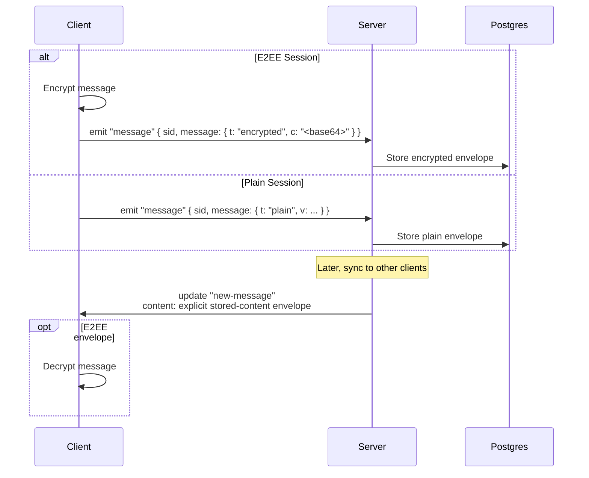

- The client emits an explicit `{ t: "encrypted", c }` or `{ t: "plain", v }`
  envelope. A legacy ciphertext string is normalized to the encrypted branch.
- The server enforces that the envelope kind matches the Session's persisted
  `encryptionMode`, stores it as `SessionMessage.content`, and emits the same
  canonical envelope in `new-message` updates.

### Machine metadata + daemon state
- E2EE Machines retain the client-encrypted per-Machine branch. In current development
  source, a present `dataEncryptionKey` envelope selects the exact Machine content key
  for metadata and RPC. Account content material opens that envelope, including the
  existing content-key derivation for recovery-secret credentials; it does not replace
  the selected key. Only a genuinely absent/null envelope retains the historical
  credential-specific Account-key or legacy-secret reader.
- A malformed or unopenable present Machine envelope fails closed. UI hydration locks
  the Machine and retires its previous cipher and decrypted Machine cache; a later
  valid envelope can hydrate it again. The CLI's
  `callExactMachineRpc` accepts `expectedEncryptionMode: 'e2ee'` captured from verified
  context. It rejects a substituted plain marker before payload emission and never
  follows Machine replacement redirects. Ordinary
  `callMachineRpc` retains its existing replacement behavior.
- Successful opening and the expected-mode check do not authenticate the provenance
  of a published scoped key, so scoped Machine-content keys for a Temporary computer
  carry their own signed binding. In current development source the creator seals the
  Runner runtime bootstrap and the Runner opens it with
  `openVerifiedRunnerRuntimeBootstrap` (`apps/cli/src/ephemeralRunner/runtimeBootstrap.ts`):
  the bootstrap must name the exact Home identity, activation, creator Account, Session,
  Machine, installation and launch-manifest commitment, its binding must equal the one
  the creator already reviewed, and `verifyRunnerMachineContentKeyBindingV1` must verify
  the `happier.ephemeral-runner.machine-content-key` payload — including the content-key
  fingerprint — against the creator's activation signing key. That activation key is the
  proof root: it is derived locally from this Runner's own activation package and
  recorded by the Home when the creator created the activation, never taken from a
  relayed field, so a DataKey-only or token-only creator needs no Account signing
  authority. Any mismatch zeroizes the key material and fails closed with
  `runner_runtime_bootstrap_binding_invalid`. The server verifies the same binding
  before review (`activationProgress.ts`) and before materialization
  (`materializeEphemeralRunner.ts`), and persists it as the Machine's
  `runnerContentKeyBinding`; a Plain endpoint must carry no binding at all. The feature
  remains unreleased, and its composed release checks do not make this implemented path
  absent.
- A protected external Action can target that Runner. The API Token-authenticated
  `GET /v1/machines` bootstrap projection names a Runner Machine with its kind, winning
  installation, Account-sealed `dataEncryptionKey` envelope and that same
  `runnerContentKeyBinding`; a persistent Machine keeps the released
  content-free projection. The SDK opens the envelope with its Account
  `{ type: 'dataKey', machineKey }` material, resolves the key through
  `resolvePublishedMachineDataEncryptionKeyV1` with the Home identity, creator Account
  and exact Machine taken from its own locally pinned credential, and seals the V2
  request with the resolved Runner content key. A substituted binding, verifier fact,
  envelope or Machine fails closed with `invalid_encrypted_envelope`; the SDK never
  downgrades a Runner target to plaintext or to Account-only sealing. The Runner opens
  the request with the same key it received in its verified bootstrap and executes only
  inside its own Session, so the Home relays bytes it cannot read in either direction.
  An endpoint that serves no bootstrap projection at all — a daemon-hosted Action API —
  keeps the released Account sealing, which discloses nothing and simply cannot be
  opened by a Runner.
- Plain Machines carry base64-encoded `{ t:'plain', v }` metadata/state and use the
  corresponding plain marker in `dataEncryptionKey`.
- Machine RPC uses the persisted Machine row mode. Token-only callers never enter the
  account-cipher path.
- Used in:
  - `POST /v1/machines`
  - WebSocket `machine-update-metadata` / `machine-update-state`
  - `update-machine` events

### Personal Machine Pool administration (0.3 development)

Personal Machine Pool definitions are server-readable Account administration data.
The Pool name, optional description, member Machine IDs, priority tiers, enabled
bits, revisions, timestamps, and current availability projection are not encrypted
with the Account content key, including for an E2EE Account. This is required so the
Home can validate membership, apply optimistic concurrency, observe generic Machine
presence, and resolve an exact Machine.

That boundary does not change Machine or Session content encryption. Pool membership
does not disclose encrypted Machine metadata or daemon state, grant Machine RPC or
Session access, carry credentials, or widen Account authority. After selection, the
client binds the returned Machine ID to its captured Home and the existing exact
Machine and Session encryption checks apply. Names and descriptions therefore must
not contain secrets that the user expects Happier's Account E2EE to hide from the
Home operator.

Pool change notifications preserve that boundary: `AccountChange` carries only the
Pool ID as an invalidation, and an authenticated client rereads the definition from
the same Home. The optional Session `placementOrigin` carries only the Pool ID. Pool
names, descriptions, member IDs, tiers, availability observations, request keys, and
candidate lists are never copied into shared Session content as placement metadata.

A personal Machine Pool also has no relationship to a Connected Service Pool. The
latter selects a credential source; the former selects an execution location. Pool
membership grants neither credential access nor broker authority. Current development
source can use a personal Machine Pool as a Team credential resource's broker
location, but the Pool is resolved server-side to one source-eligible exact Machine.
Only a content-free eligibility result crosses the daemon RPC boundary; source
settings, credentials, endpoint material, and the private Pool roster do not become
recipient-visible. The exact Machine then uses the existing encrypted carrier and
resource admission path.

### Artifacts
- E2EE Artifact `header` and `body` are encrypted bytes encoded as base64.
- Plain Artifact values are base64-encoded `{ t:'plain', v }` envelopes with the
  canonical plain data-key marker.
- Stored as `Bytes` in the DB.
- Emitted in `new-artifact` / `update-artifact` events as base64 strings.

Plugin Account-hosted UI and Package Asset archives use this same mode-aware
Artifact envelope, not a separate encryption format. The client requires explicit
Account hosting consent before publishing bytes; install and trust are not
consent. Package Asset publication seals the verified archive through
`activePluginAccountHostedArtifactRead.ts`, and its protected reader opens it
through `activePluginAccountPackageAssetRead.ts`. Release links and integrity
descriptors remain server-visible metadata in both modes. Availability owns the
qualified release link: disable-and-remove atomically removes the link and its
Artifact, while disabling hosting alone prevents later publication.

The release link keeps the contribution selection and generated `artifactId`
separate from the Account storage carrier's `accountArtifactId`. Byte providers
(daemon, packaged app, or Account hosting) are interchangeable sources for the
selected digest; none can admit a release or renderer. Clients verify the selected
digest before adoption, and persistent physical bytes are partitioned by server and
Account rather than by projection generation or app/runtime compatibility metadata.

### Access keys
- `AccessKey.data` is treated as an **opaque encrypted string**.
- The server does not decode it or inspect its contents.

### Key-value store
- `UserKVStore.value` is intentionally opaque bytes encoded as base64 on the wire.
- `kvMutate` expects base64 strings; `kvGet/list/bulk` return base64 strings.
- Each domain using KV owns its content contract. For example, Todo owns its explicit
  plain/encrypted envelope; KV must not guess by attempting decryption.

Session drafts reserve a typed `UserKVStore` key prefix instead of exposing their rows through the
generic KV API. The draft routes carry an explicit content envelope and enforce its owner:

- a new-Session draft follows the Account encryption mode and uses Account-scoped key material;
- an existing-Session draft follows that Session's fixed encryption mode and, in E2EE mode, uses
  the Session data-encryption key;
- raw attachment bytes, local file handles and URIs, credentials, secret values, and local
  presentation state are not part of synchronized draft content.

This keeps one draft document and synchronization contract without weakening the different key
ownership of Account-scoped and Session-scoped data.

Snapshot hydration distinguishes a temporarily unavailable existing-Session key/context from an
invalid envelope or payload. It may skip only the unavailable Session record while continuing to
materialize other Account drafts; malformed or mode-incompatible content fails the snapshot so it
cannot be silently classified as a local key-loading condition.

## On-wire formats (mode-aware fields)

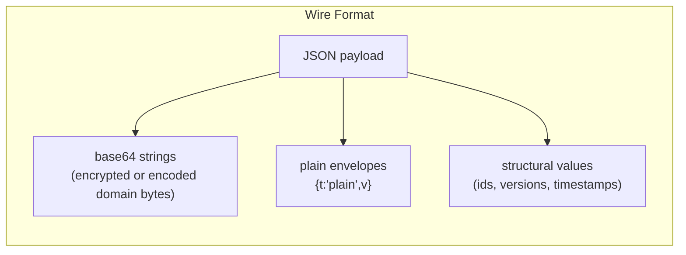

Below are representative shapes. Exact domain routes may encode a plain envelope as
JSON or as base64-wrapped canonical JSON. A base64 string is an encoding, not proof
that the value is encrypted.

### Session creation
```http
POST /v1/sessions
```
```json
{
  "tag": "<string>",
  "encryptionMode": "e2ee | plain",
  "metadata": "<mode-compatible encoded value>",
  "agentState": "<mode-compatible encoded value or null>",
  "dataEncryptionKey": "<base64 data key bundle for e2ee; null for plain>"
}
```

### Session message (client -> server)
```
Socket emit: "message"
```
```json
{
  "sid": "<session id>",
  "message": { "t": "encrypted", "c": "<base64 encrypted>" }
}
```

For a plain Session, `message` is `{ "t": "plain", "v": <json> }`.

### Session message (server -> client)
```
update.body.t = "new-message"
```
```json
{
  "t": "encrypted",
  "c": "<base64 encrypted>"
}
```

or:

```json
{
  "t": "plain",
  "v": "<json>"
}
```

### Session metadata update (WebSocket)
```
Socket emit: "update-metadata"
```
```json
{
  "sid": "<session id>",
  "metadata": "<mode-compatible encoded value>",
  "expectedVersion": 3
}
```

### Machine update (WebSocket)
```
Socket emit: "machine-update-state"
```
```json
{
  "machineId": "<machine id>",
  "daemonState": "<base64 encrypted or base64 plain envelope>",
  "expectedVersion": 2
}
```

### Artifact create/update (HTTP)
```http
POST /v1/artifacts
```
```json
{
  "id": "<uuid>",
  "header": "<base64 encrypted or base64 plain envelope>",
  "body": "<base64 encrypted or base64 plain envelope>",
  "dataEncryptionKey": "<base64 data key bundle or canonical plain marker>"
}
```

### KV mutate (HTTP)
```http
POST /v1/kv
```
```json
{
  "mutations": [
    { "key": "todo.index", "value": "<base64 domain-owned envelope bytes>", "version": 2 },
    { "key": "prefs.legacy", "value": null, "version": 5 }
  ]
}
```

## Client-side content types

These are representative structures before mode-specific encoding. E2EE branches
encrypt them; plain branches place them in the domain's strict plain envelope. They
are defined in `apps/cli/src/api/types.ts` and the corresponding Protocol domain
schemas.

### Session message content

The payload stored in `SessionMessage.content` is always explicitly wrapped. For an
E2EE Session:
```json
{ "t": "encrypted", "c": "<base64 encrypted>" }
```

For a plain Session:
```json
{ "t": "plain", "v": { "role": "user", "content": { "type": "text", "text": "..." } } }
```

### Message payload before mode-specific encoding

**User message**
```json
{
  "role": "user",
  "content": { "type": "text", "text": "..." },
  "localKey": "...",
  "meta": { }
}
```

**Agent message**
```json
{
  "role": "agent",
  "content": { "type": "output | codex | acp | event", "data": "..." },
  "meta": { }
}
```

### Metadata
```json
{
  "path": "...",
  "host": "...",
  "homeDir": "...",
  "happyHomeDir": "...",
  "happyLibDir": "...",
  "happyToolsDir": "...",
  "version": "...",
  "name": "...",
  "os": "...",
  "summary": { "text": "...", "updatedAt": 123 },
  "machineId": "...",
  "claudeSessionId": "...",
  "tools": ["..."],
  "slashCommands": ["..."],
  "startedFromDaemon": true,
  "hostPid": 12345,
  "startedBy": "daemon | terminal",
  "lifecycleState": "running | archiveRequested | archived",
  "lifecycleStateSince": 123,
  "archivedBy": "...",
  "archiveReason": "...",
  "flavor": "..."
}
```

### Agent state
```json
{
  "controlledByUser": true,
  "requests": {
    "<id>": { "tool": "...", "arguments": {}, "createdAt": 123 }
  },
  "completedRequests": {
    "<id>": {
      "tool": "...",
      "arguments": {},
      "createdAt": 123,
      "completedAt": 123,
      "status": "canceled | denied | approved",
      "reason": "...",
      "mode": "default | acceptEdits | bypassPermissions | plan | read-only | safe-yolo | yolo",
      "decision": "approved | approved_for_session | denied | abort",
      "allowTools": ["..."]
    }
  }
}
```

### Machine metadata
```json
{
  "host": "...",
  "platform": "...",
  "happyCliVersion": "...",
  "homeDir": "...",
  "happyHomeDir": "...",
  "happyLibDir": "..."
}
```

### Daemon state
```json
{
  "status": "running | shutting-down",
  "pid": 123,
  "httpPort": 123,
  "startedAt": 123,
  "shutdownRequestedAt": 123,
  "shutdownSource": "mobile-app | cli | os-signal | unknown"
}
```

## Content-open flow (client side)

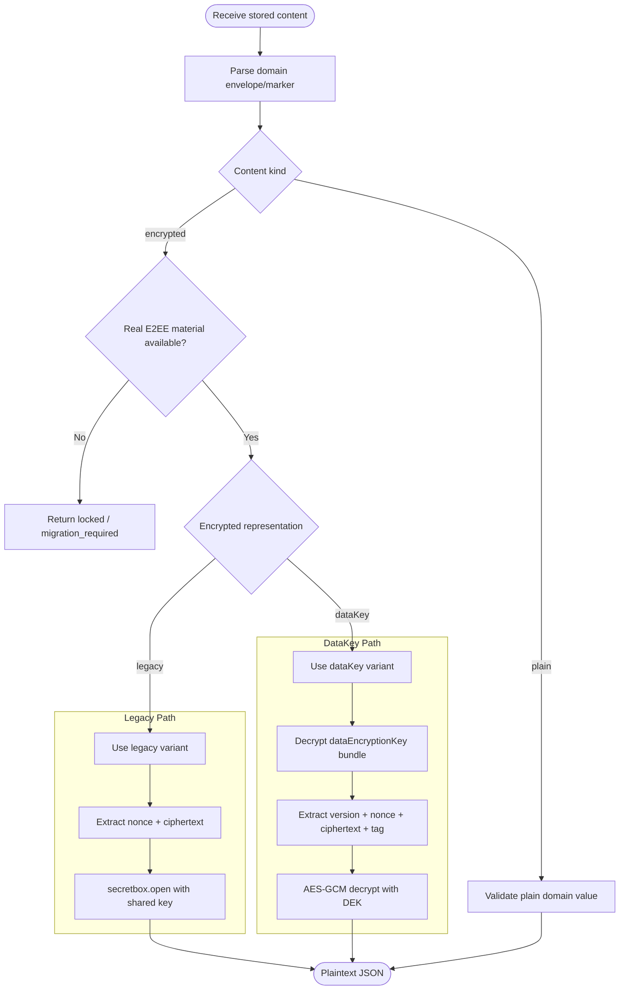

- Parse the domain's strict representation before choosing a crypto path.
- Return a validated plain value directly for `{ t: "plain", v }`.
- Enter the Account or Session cipher only for the encrypted branch and only with real
  matching material.
- If material is absent or ciphertext cannot be opened, preserve the stored value and
  return a typed locked/migration-required result. Do not try the plain branch after a
  decryption failure.

For a published `dataEncryptionKey` bundle, clients first open the envelope with the appropriate recipient material, then use the recovered data key for content. A failed envelope open never authorizes an Account-key fallback; the historical absent-envelope reader is owner-only and is described under [Recipient key delivery](#recipient-key-delivery-development).

## Server-side at-rest sealing

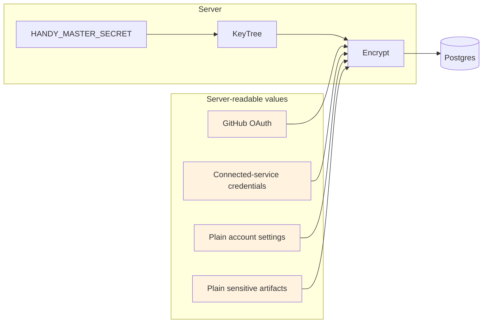

The server encrypts certain OAuth/service tokens and may seal selected plain-account
settings, connected-service credentials, and Artifact content at rest. These values
use a server-only KeyTree derived from `HANDY_MASTER_SECRET`; they are not end-to-end
encrypted. The server opens them for authorized application use and returns canonical
plain envelopes, never the internal `sealed_v1`/`server_sealed` wrapper.

`none` stores the canonical plain representation directly in the database.
`server_sealed` reduces exposure of database files and backups that do not also include
the master secret. It does not protect against a compromised live server or an
operator/process that can access both the database and `HANDY_MASTER_SECRET`.

Backups that may contain server-sealed values are recoverable only with the exact
matching `HANDY_MASTER_SECRET`; light-flavor backups must also preserve the generated
`handy-master-secret.txt`. The current server initializes one active KeyTree and has no
multi-key read or automatic re-seal rotation path. Do not rotate the master secret in
place: retain it through restore, or first implement and verify a domain-complete
old-key-to-new-key re-seal procedure. Changing it directly can make sealed values
unreadable and also affects other auth/token material derived from the same secret.

## Encoding conventions

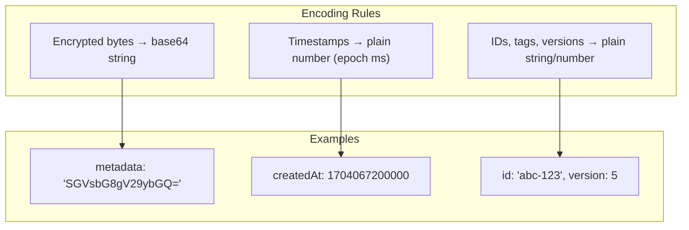

- Encrypted bytes are base64 strings on the wire unless explicitly noted.
- Some domain-owned plain envelopes are also base64 encoded for byte-oriented routes;
  base64 does not imply confidentiality.
- Timestamps remain plain numbers (epoch ms) and are not encrypted by the server.
- Non-encrypted identifiers (ids, tags, versions) are always plain strings/numbers.

## Session storage modes

Sessions can store transcript content in encrypted-at-rest or plaintext-at-rest mode. This is a storage mode, not a transport-security or authentication mode.

Canonical concepts:

- **Server storage policy:** `required_e2ee | optional | plaintext_only`, surfaced through `/v1/features`.
- **Account encryption mode:** `e2ee | plain`, used as the default for new sessions.
- **Session encryption mode:** `e2ee | plain`, fixed at session creation so a transcript does not mix modes.
- **Client encryption requirement:** `follow_account | require_e2ee`, resolved strongest-wins from the synced Account preference, a UI device-local pin, and the daemon's `HAPPIER_ENCRYPTION_REQUIREMENT` override.
- **Content envelope:**
  - encrypted content: `{ t: 'encrypted', c: string }`
  - plaintext content: `{ t: 'plain', v: unknown }`

Write paths must enforce mode/content-kind compatibility:

- `e2ee` sessions accept encrypted content only.
- `plain` sessions accept plain content only.

Clients must parse the envelope and branch explicitly. Do not guess that content is encrypted.

`require_e2ee` is enforced at the Account-settings and Session-content choke points. A client must reject a plaintext Account envelope before publishing it, reject plaintext session creation or a create-or-load response, and avoid opening or authoring plaintext Session content. The UI device-local pin remains scoped with the existing server/account settings persistence; the synced preference reaches a daemon through the existing Account-settings snapshot and pre-spawn minimum-version hint. No relay API or separate UI-to-daemon policy field owns this decision.

Missing client-requirement fields preserve the released behavior (`follow_account`). The daemon environment override can only strengthen the effective requirement; invalid non-empty values fail startup.

Layout-1 Session owner metadata is a separate privacy contract approved by
`PLAINTEXT-ACCOUNTS-2026-07-30.6`. Current source carries one strict plain/encrypted
owner envelope through the canonical tuple and recipient projector. The server may
read the strict plain owner branch for a plaintext Account, but only the Session owner
may receive that branch. View, edit, admin, friend, and public recipients receive the
  strict shared projection and an authoritative Agent-state tombstone. Edit/admin is an
action authorization level, not owner-private data access. Current-format operations
require a current caller declaration. Release readiness remains gated by mixed-version
proof and the remaining integration/live checks, not by an operator activation mode or
legacy socket drainage.

Sharing rules:

- Plain sessions can share without `encryptedDataKey` because access is server-managed.
- Decrypting an E2EE Session or public share requires a valid encrypted data-key
  envelope; a direct grant may remain pending while its recipient completes
  Account encryption setup.

Direct Account sharing keeps key authority inside trusted clients. The public
`session.access.grant.set` Action and New Session access draft describe only the
desired recipient and access level. Before the physical grant or create request,
the UI or CLI/daemon host reads the exact Session DEK, verifies the recipient's
current Account content-key binding, and seals that DEK for the recipient. The
server then admits the grant and opaque envelope in one transaction. Plain
Sessions and recipients whose authoritative readiness is unavailable remain key-free;
an `encryption_inconsistent` recipient retains its repair-required locked state.
When preparing a new envelope, malformed readiness or an invalid advertised-ready
binding fails before the grant request; clients never reinterpret those failures as
unavailable readiness. A host unable to open the Session DEK can instead submit the
key-free logical grant for the server to recheck recipient readiness and any retained
tuple. Agents, plugins, and SDK callers never supply recipient-envelope fields
themselves.

Public-link creation follows the same custody boundary without reusing the
recipient-envelope format. The public `session.public_link.create` Action accepts
only publication settings. Both exact-Home physical hosts — the CLI/daemon
Account-server Action dependency and the UI Session-access family leaf — generate
the bearer, open the current Session DEK when the Session is E2EE, and materialize
the existing route's private `token` and `encryptedDataKey` fields immediately
before dispatch. Neither the UI nor any other client keeps a second public-share
client: `session.public_link.get`, `.create`, and `.remove` reach the released
owner route only through that one declared Action transport. Plain Sessions send no
wrapped key. Protocol owns the deployed V0 SecretBox payload and framing: current
UI and CLI writers emit the serialized-JSON form, while readers retain the released
plain-JSON form for compatibility. Action results project only safe publication
settings — expiry, use limits, use count, consent, plus the non-secret publication
`id` and `updatedAt` a trusted host needs to prove an ambiguous create actually
changed the publication. The bearer and wrapped DEK are never projected; the
generating device reports its own bearer to the mounted host and remains the only
place a usable link can be assembled.

Team credential resources and shared Saved Secrets in current 0.3 development source reuse these
Account-mode boundaries; their product activation remains gated and unverified. Brokered Team
credential use does not publish usable credential bytes to the recipient. Direct delivery does:
an E2EE recipient receives material encrypted to its current verified Account content-key binding,
while a plaintext recipient receives an explicit plain stored-content envelope that the live Home
can read. A plaintext Account never receives fabricated Account E2EE material. Source, recipient,
credential revision, configuration revision, authentication mode, and encryption binding are
rechecked when material is written and read so a stale preparation cannot replace current material.

A shared Saved Secret has one mutable resource value and Account, Team, or Group use grants. It is
not copied into each recipient's personal Settings. Promoting a personal Saved Secret must create
the shared resource and rewrite every owner reference atomically, leaving either the old personal
record or the new shared record—not two mutable sources. E2EE resources use a resource data key
wrapped for eligible recipient Accounts; plain material uses the canonical server at-rest codec.
Mixed plain/E2EE audiences are prepared per recipient, and one recipient's missing encryption
readiness does not reinterpret encrypted material as plain.

Possessing an envelope or a previously disclosed value is not current authorization. Every read
rechecks the current grant and Home-local Team/Group membership. Revocation stops later reads but
cannot erase material a direct recipient already obtained.

Session data-key persistence:

- Each current E2EE Session has one standalone Session data key (DEK). Session
  content is encrypted once with that DEK; sharing wraps only the DEK for each
  authorized Account rather than encrypting the transcript again.
- `SessionDataKeyEnvelope(sessionId, recipientAccountId)` is the only owner of a
  Session data-key envelope. It holds the Session owner's envelope and every other
  recipient's, so no reader branches on ownership to decide which column to read.
- Direct, Team, and Group grants all resolve through the access owner to Account
  recipients. If several grants authorize the same Account, they still require only
  the one `(sessionId, recipientAccountId)` tuple. Plain Sessions have no Session
  data-key envelope at all.
- `Session.dataEncryptionKey` and `SessionShare.encryptedDataKey` are removed. Their
  bytes were copied forward exactly by an expand/backfill migration and the columns
  dropped by a following contract migration; that contraction is irreversible for a
  predecessor binary, so a managed rollback past it is not supported.
- Malformed persisted bytes are preserved rather than discarded, so a recipient
  reaches a truthful repair state. Structural admission applies to new writes only.
- Access is always decided before projection. A retained tuple after revocation is
  inert: it is simply never projected again, and it never grants access.
- `PublicSessionShare.encryptedDataKey` is a separate owner and is unchanged.
- The released `session-shared` socket event no longer carries key bytes; clients
  targeted-hydrate the Session projection instead.

Feature gates:

- `encryption.plaintextStorage`
- `encryption.accountOptOut`

Do not gate plaintext behavior on raw env vars or `capabilities` fields.

### Recipient key delivery (development)

`GET`/`PATCH /v2/sessions/:sessionId/data-key/envelopes` is the one surface for
preparing recipient envelopes. The server's `sessionDataKeyEnvelopeService.ts` owns its
behavior and `registerSessionDataKeyEnvelopeRoutes.ts` is a thin transport that maps one
stable error code to one status. The service composes decisions it does not own:
effective access from the Session access owner, recipient readiness from the Account
encryption owner, and envelope structure from the Protocol codec. It is not feature
gated, because it is the envelope owner for every access kind including plain direct
sharing and owner repair.

The canonical record is the `(Session, recipient Account)` tuple, and three owners keep
it coherent. `sessionDataKeyEnvelopePersistence.ts` stores and projects the opaque bytes.
`sessionDataKeyRecipientProjection.ts` is the one wire projection of a recipient's
content-key binding, shared by the per-Session collection and the membership-history page
so the readiness columns, their reason vocabulary, and their encodings are never answered
twice. `classifySessionDataKeyEnvelopeItemV1`, in the Protocol module
`sessions/encryption/sessionDataKeyEnvelopes.ts`, is the one owner of summary-bucket
precedence, so the aggregate a manager sees and the rows beneath it are the same
classification applied twice, not two rules. That module also owns the strict boundary
shapes; effective access, the recipient audience, Account content-key readiness, and the
tuple read/write stay with their own owners. See
[session-collaboration.md](session-collaboration.md) for how access, key delivery, and
personal state divide the Session surface between them.

Access is answered first, and the two answers stay distinct on purpose: a Session the
caller cannot read reports `session_not_found`, so it is indistinguishable from one that
does not exist, while a readable Session the caller cannot manage gets an honest
`forbidden`. A plain Session then settles as `not_required` before any recipient key
material is read, so a keyless Account is never asked for key state it does not have.

`GET` returns one bounded exception page plus a Session-scoped summary over the whole
current authorized audience — including the Session's owner, whose envelope lives in the
same tuple. The audience is walked in bounded chunks through the same readiness and
codec owners the rows use, so the summary cannot disagree with the rows a manager
expands. `action_required` is the default working page and carries exceptions only;
`all` is the same audience as a diagnostic view. Envelope state describes stored bytes
alone — `prepared`, `missing`, or `invalid` — and unavailable recipient readiness
outranks it, because an inert tuple left behind by an earlier preparation must not
report a Plain or inconsistent Account as prepared.

`PATCH` applies a bounded set atomically: every check runs before the first write, so one
bad entry leaves the collection exactly as it was rather than half prepared. The caller
must itself hold a structurally valid envelope for the Session (`session_data_key_unavailable`
otherwise), because only the invoking client can prove it opens that Session's standalone
key. A recipient that lost read access answers `recipient_changed`; one whose Account is
not wrapping-ready answers `recipient_key_unavailable`. Replacing a structurally valid
envelope is allowed and is the repair path: randomized ciphertext for the same data key
is equivalent, so last write wins without a revision or digest.

The shared GET/PATCH page boundary is 500 recipients. It is not a total audience
limit: larger audiences continue through the same Account-keyset cursor. The bound
was validated against the canonical 100 MiB server request boundary and the real
SQLite tuple-write plus private AccountChange owner at 24, 100, and 500 entries;
the observed atomic service times were approximately 253 ms, 1,023 ms, and 3,444
ms. Those measurements establish a supported request size, not a latency SLA.
Client sealing remains cooperatively sliced by its existing crypto batch owner.

A tuple is never authorization. `sessionDataKeyEnvelopePersistence.ts` stores and projects
opaque bytes and never grants, opens, or synthesizes a data key, and a retained tuple
after revocation is inert — simply never projected again. Account mode, recipient
readiness, and successful envelope opening remain separate facts. The Home owns mode
and readiness and validates envelope structure; only the recipient can authenticate
and open the envelope.

The released 0.2 direct-share request remains a narrow compatibility seam. On a 0.3
Home, its adapter delegates access to the current Session-access owner and envelope
storage to this tuple owner; it does not restore either removed column or become a
second authorization or persistence path. Team, Group, and history preparation are
new 0.3 operations, not capabilities retrofitted onto the 0.2 wire.

An absent envelope is not the same as a present unopenable one. Only the Session's own
owner may resolve genuine absence through the retained cli-v0.2.11 Account-scoped reader.
Those Account keys are historical content material, never a transferable Session data
key, so a recipient must not reach that path and a present unopenable envelope must never
be normalized into absence in order to reach it. The client resolves absence into pending,
setup, or that owner-only reader; the server does not decide it.

Implementation status. The per-Session collection, its persistence owner, and the
invoking-client preparation passes exist in development source; the passes share one
bounded page → seal → commit owner and differ only in worklist. The Team/Group
membership-history surface now has one server service mounted from the existing Team
and Group membership routes plus one client preparation host. It pages only Sessions
that both the caller and target may currently read and writes through the same
`SessionDataKeyEnvelope` persistence owner; it does not create Team/Group keys or a
second preparation store.

Client surfaces (development). The mounted Collaboration/Access editor renders one
Session-scoped `Encrypted access` aggregate from the Home's own summary — it never
recomputes counts from grant rows, because a Team grant is one row and many Accounts.
Opening or refreshing the editor discovers current work, so an existing grant whose
member finished setup on another device is found without mutating that grant. The same
`createSessionDataKeyEnvelopeClient` transport serves default discovery, the explicit
`Show all recipients` diagnostic over `state=all`, and the preparation pass, so the
aggregate and the rows below it cannot disagree. Healthy audiences stay quiet, and the
diagnostic's healthy rows are requested only when a manager opens it.

Preparation is owned by its exact Home/Account/Session-or-membership scope and encryption
generation, not by the sheet that started it: closing the sheet detaches presentation
while the in-flight pass continues, and only a real scope or generation change stops the
next write. There is no durable job, progress store, or operation registry. Determinate
progress counts committed tuples against the Home's own actionable total (`pending +
invalid`), which only grows — the one final first-page recheck may reveal work committed
behind the cursor. That recheck now runs after every traversal, including an initially
empty first page with no writes, because an empty page proves only what the Home saw at
that instant.

This makes preparation process-local but resumable: an app exit or interruption loses
only in-memory progress. A later pass derives the remaining work again from canonical
access, Account readiness, and missing or invalid tuples. Missing tuples stay pending;
invalid or locally unopenable tuples reach repair UI instead of being treated as absent,
plaintext, or unauthorized.

Member detail keeps the two server exception buckets separate all the way to the copy:
repairable caller envelopes get repair guidance, while permanently non-transferable
released Account-secret Sessions get an explanation and no futile repair instruction. A
locally empty failure set never erases either. An `incomplete` pass is remaining work
with a retry, not an error; `recipient_changed` refreshes the canonical membership before
anything is retried. Choosing to include existing history at member or Group-member
addition continues at that member's detail, where the same operation starts once.

Authorized Sessions whose content is still locked stay visible. `isUserFacingSession`
keeps a row whose access projection names the viewer as a recipient even when its
encrypted metadata cannot be read, and list and detail share one owner for the locked
title: a safe cached title is kept, and only its absence falls back to the translated
`Encrypted session`. Owners remain fail-closed there, because hidden-system facts are
layout-1 owner-private keys and are genuinely unknown when the owner view is unavailable.
Plain Sessions and Plain Accounts reach none of this: the collection settles
`not_required` before any recipient key work and the editor renders no encryption row.

The ordinary Account-backed Follow runtime now observes, hydrates, re-admits, injects,
and acknowledges exact source updates through the canonical Session runtime. In current
development source, restricted Runner Follow also has one consumed scoped source-key
carrier: the qualified producer opens only the physical standalone Session DEK, the
server rechecks the exact Follow/source/destination/Runner/Machine authority, and the
restricted runtime keeps copied source material only in process-local zeroizing custody.
That path remains unreleased and not live-verified. The creator-authenticated scoped
Runner-Machine key binding it depends on is implemented and verified on both sides
(see Machine metadata + daemon state above); the composed preparer-disconnect/
reconnect/revocation/cleanup journey is still required before activation can be
called complete. No loaded
Teams/Runner/native, cross-provider, or release validation is claimed complete here.

Session Discussions, Board/System Records, and Follow context reuse the same Session
encryption context and ordinary Session DEK; none owns another content-key hierarchy.
External API request/result encryption is different: it is Lane 05's whole-Action
transport contract, using the optional Account API-credential material described above,
and does not create, return, or replace a Session envelope. The restricted Runner path
remains subject to the explicit unreleased and unverified boundary above.

Runner Connected Services remain development-only. Endpoint-native selections carry no
Account material. Account-backed and Team-resource selections are rejected before
activation and by the strict review manifest until Lane 10 supplies a scoped
Connected-Service broker producer. The runtime bootstrap rejects direct Connected
Account credential and configuration material; the creator never opens that material
for Runner delivery. The endpoint retains the ordinary purpose-scoped plugin capability
with no Account bindings. Built-in and external plugins use the same SDK authority;
this restriction concerns Account-secret custody, not plugin trust. Ordinary Session
and SDK Connected Account behavior is unchanged. The scoped broker integration and
loaded Runner journey remain unverified and are required before claiming support.

### Plaintext Personal Home search

Plaintext Personal Homes can maintain `derived/search.sqlite`, a Home-local
FTS projection rebuilt from canonical plain Session messages. It is derived,
replaceable state: startup reconciliation, live transcript mutations, restore,
explicit repair, and recognized SQLite corruption rebuild it through the Home
search lifecycle. The projection does not become a second transcript authority
and does not copy Account ACL or sharing state.

`POST /v1/home/search` is the one source-specific Home search endpoint. It is
feature-gated by `search`, authenticates a present user, resolves that user's
currently visible Session ids through the canonical authorization owner, and
passes those ids into the Home database query. Authorization therefore remains
query-time even though the plaintext-derived index can contain rows for other
users' Sessions. The endpoint is not a Universal Search aggregation service.

Home results are message-granular. The shared memory-search `summary` field
contains a match-centered snippet rendered from pristine message text, falling
back to the whole text only when it fits; callers must not describe it as a
guaranteed full verbatim message.

E2EE Session content is never admitted to this Home index. A non-plaintext Home
does not construct the lifecycle, advertise Home-search readiness, or expose a
usable Home search route. `capabilities.homeSearch` reports readiness only; it
does not authorize search and does not weaken the Account/Session envelope
rules above.

### Account-mode transition status

Account mode and Session transcript mode are separate: an Account transition does not
re-encrypt Session messages or change a Session's persisted `encryptionMode`.
Layout-1 owner metadata is different because its owner envelope is Account-scoped and
must match the Account mode.

Every active new-Session draft participates in the incumbent atomic Account mode-transition
request. Existing-Session drafts do not participate: their envelope remains bound to the owning
Session. A missing or incomplete draft census, a revision mismatch, or a wrong target envelope
aborts the Account transition without partially changing the mode. The partially adopted staged
transition is not a second draft owner and has no draft-specific staging table.

The development draft V2 contract includes new-Session authoring that released strict V1 cannot
generally preserve. Such Account transitions select `sessionDrafts: { v: 2, items }` and receive
`sessionDrafts: { v: 2, records }`, including on exact lost-response replay. The same draft service,
Account cipher, revision CAS, and document reconciliation owner serve both versions.

The current moving `../0.2` predecessor has one deliberately narrow new-Session bridge. A
representable exact-Machine target is projected with predecessor-visible `serverId` and `machineId`
mirrors carrying the canonical target mutation identity. A predecessor text-only edit leaves those
mirrors unchanged, so the successor restores the exact target and its informational Pool origin.
When the predecessor deliberately changes or clears the Machine target, the successor reconstructs
that exact predecessor choice and clears the old Pool origin. Missing, partially changed, malformed,
or otherwise ambiguous mirror state is unusable; it never silently revives the retained target.
Temporary-computer and every other non-representable target remain V2-only and are not downgraded.
Plain and E2EE drafts use this same reconciliation contract, with only their existing content
envelope differing. This bridge preserves the one canonical draft owner; it neither widens released
V1 nor creates a second compatibility writer. An incapable request still cannot overwrite V2
content. Session-bound Run, discussion, and new-discussion drafts remain excluded from the Account
transition.

Approved amendment `PLAINTEXT-ACCOUNTS-2026-07-30.7` adds one request-size-bounded
`sessions: assert_empty | migrate` directive to the existing Account transition.
Each migration item covers exactly one active or archived layout-1 Session and
carries `sessionId`, expected layout `1`, exact metadata and Agent-state versions,
the exact expected owner envelope, and the exact target owner envelope. The server
uses Account-first lock order and the existing Session tuple CAS/projector, changes
only the owner envelope plus canonical versions/cursors, completes every Session
rewrite before the final Account mutation, and rolls the whole transition back on
conflict. It does not re-encrypt Session transcripts or change Session mode, keys,
sharing, lifecycle, or archive state.

The Session directive has no separate item-count ceiling. The existing canonical
8 MiB Account-migration request boundary limits the real transport payload, while
the server compares the complete owner inventory and commits all Session rewrites
inside the same Account-mode transaction.

For a truly keyless Account, `.7` requires fresh GitHub/OIDC/OAuth/mTLS
reauthentication through the existing external-auth challenge and identity-proof
owner before the first E2EE key may be attached. A stored Happier bearer, a proposed
key signature, or a client/server nonce alone is insufficient. The proof is
short-lived, single-use, and bound to the Account, external identity, and canonical
migration request.

Exact lost-response replay canonicalizes the request once for signatures and fresh
reauthentication. The raw digest is not placed in the client-visible change stream;
the server stores only a domain-separated master-secret binding in the existing final
account/self `AccountChange` hint. Only the identical request at the exact committed
post-state returns read-only success; missing, pruned, overwritten, stale, or
mismatched evidence fails closed. There is no receipt table, worker, second replay
owner, raw-request storage, or offline equality oracle for prior plaintext.

Current source implements the `.7` active-plus-archived Session directive,
fresh GitHub/OIDC/OAuth/mTLS first-key authority, canonical request digest, and exact
read-only server replay. The UI owner/callback/storage boundary retains one bounded,
expiring, server-scoped continuation and retries the exact stored request before
starting fresh authentication. Authoritative E2EE Settings hydration performs one
bounded retry without a new challenge; credentials persist before custody clears.
The strict literal `migrationSubmissionAttempted?: true` marker is persisted with the
pending handle before the first POST, and a failed custody write produces zero POSTs.
Only a definitive first-submission 4xx except 408/429 may clear custody; ambiguous
transport/5xx/408/429, commit-observed/post-persist, and every later failure retain it.
The root-independent final rerun is green at 45/45, direct UI TypeScript 7 is green,
and the scoped diff check is green pre-gap evidence. First-key resume now owns one
exact POST per resume with hidden API backoff disabled only for this path; marked
active-server mismatch retains custody before rejection with zero POST/persist/clear,
while unmarked mismatch keeps prior cleanup. Module-local mutation serialization and
bounded primary→legacy→global lookup close the stale-state race and legacy-reader
omission; root-independent evidence is 67/67 including exact concurrency, direct UI
TypeScript 7, and scoped diff green. Cross-tab/worker serialization remains a platform
residual. Approved amendment `.8` guards ordinary logout and different-token
replacement before mutation, keeps successful same-token recovery signed in for
recovery-key backup/copy, and permits credential destruction only after
warning-backed exact abandonment removes the observed marked record. A clear failure
preserves credentials; 401/token invalidation is not abandonment. Amendment `.9` is
the current approved contract and extends these `.8` outcomes. The
[canonical plaintext-accounts plan](../.project/plans/happier-plaintext-accounts-keyless-external-auth-and-account-data-envelopes-2026-02-23.md)
owns mutable execution status and exact QA evidence. No source result alone activates
the transition.

## Terminal pairing authentication

Terminal pairing v3 adds a 32-byte request secret to the QR/deep link and authenticates the sealed
provisioning response with HMAC-SHA-256. The requesting terminal keeps that secret in its private,
short-lived pending state and does not include it in the relay auth request. Current approval writers
require this v3 context and never emit an unbound legacy response.

Current terminal pairing is v3-only. An absent, malformed, expired, or unauthenticated v3 response
fails closed; the reader does not reinterpret it as legacy v1/v2 material. `auth request --json`
persists the complete v3 context in private pending-auth state so `auth wait` cannot accidentally
lose the binding. Historical unbound terminal requests must be replaced with a fresh v3 request.

The development UI preserves a terminal request across sign-in before an Account scope exists,
then binds it to the matching hydrated Account without renewing its expiry. Web pre-auth custody
uses tab-local session storage; native custody uses the existing pending-terminal storage owner.
Both platform adapters delegate claim, cancellation, and migration decisions to that owner.

V4 terminal links carry a Home descriptor while retaining v3 sealed provisioning. The descriptor's
Home identity and canonical URL remain the request target; the UI must never substitute the active
Home when a different loopback target is rejected by URL-selection policy. It retains the
target-bound request and reports the unavailable path instead of opening sign-in for the wrong Home.
First-time authentication to a different Iroh-only Home is not completed by this continuation fix:
it still requires descriptor-aware authentication-entry transport integration. Post-auth descriptor
approval does not establish that pre-auth capability.

Native-app QR pairing provides relay-independent authentication
because the secret travels camera-to-app. Web pairing cannot make the same guarantee against a
hostile self-hosted relay: that relay also serves the JavaScript which receives the secret, so the
web flow necessarily trusts its web origin.

The terminal-v3 provisioning union has one semantic owner and exactly two current material results:

- `tokenOnly` carries no Account E2EE material. The claim endpoint independently returns the new
  terminal bearer under claim-secret authorization, and the terminal persists a token-only
  credential without fabricating a secret.
- `dataKey` carries the exact 32-byte Account content private key. A data-key credential is validated
  against its own public key before sealing; a legacy recovery-secret credential derives the same
  content private key through the protocol derivation owner rather than a second formula. The
  terminal persists the data-key fields without collapsing them into a legacy secret.

The approver's persisted credential shape is the material authority: a keyed credential — data-key or
legacy recovery secret — yields `dataKey`, and a token-only credential yields `tokenOnly`. A requester
capability such as `supportsTokenOnly` is admission only: it may refuse an unsupported result but can
never choose or downgrade the material. Existing Account recovery credentials remain readable at their
own storage boundary, and terminal pairing still neither reads nor writes a raw or unbound legacy
response.

## External Sessions secure refresh and publication

External Sessions keeps live Agent-source content opaque to the server. Its canonical live-refresh path is:

1. the daemon emits `external-session-transcript-invalidated`, a content-free event bound to the current machine, session, link, qualified Agent/source identity, contribution generation, and a non-reversible cursor identity;
2. the client requests one bounded authoritative `readAfterTranscript` through the existing machine-encrypted RPC path; and
3. only an exact-current `advanced` result may release items to the canonical transcript convergence owner.

The invalidation contains no transcript content, title, preview, `linkData`, raw Agent cursor, or source path. The encrypted RPC response protects the complete read-after payload; External Sessions does not define per-item encryption envelopes. `already_current` applies nothing. Stale or mismatched bindings, gaps or expired cursors, source replacement, source unavailability, and read failure all apply zero items. A gap requests one bounded authoritative resync; replacement, unavailability, and failure retain the last accepted authority and surface recovery instead of accepting a truncated transcript.

The default invalidation-to-`readAfterTranscript` path has a release-like p95 budget of less than one second and must preserve dedupe, gaps, anchors, and scroll continuity with at most one bounded read per coalesced invalidation. A ciphertext fast path is not an unconditional second protocol. It may be added only after a recorded failure of that latency budget or a mandatory continuity property, and then only inside an existing encrypted socket/RPC owner with the same canonical payload and cursor semantics, server opacity, and authoritative read-after fallback on gaps.

External transcript authority is separate from the session's `e2ee | plain` content-storage mode:

| `currentStorageState` | Read authority and publication ceiling | Sharing |
| --- | --- | --- |
| `machine_only` | The linked Agent source is authoritative while reachable; server transcript readers expose no rows. | Not shareable; persisted import is required. |
| `server_partial` | The linked Agent source remains authoritative while reachable. An offline incomplete initial import is fenced at `acceptedThroughServerSeq`, and the UI may select that subset only while the matching public operation projection proves the same initial-partial fence. | Not shareable. |
| `snapshot_complete` | The Agent source remains live authority while reachable. Offline server reads are capped at `publishedThroughServerSeq` and require a complete publication tuple. | Shareable as a complete published snapshot. |
| `hosted` | The hosted transcript is authoritative; no External Sessions publication ceiling applies. | Shareable under the normal hosted-session rules. |
| `legacy_external_unknown` | Fails closed at sequence zero until the owner machine reconciles the row. | Not shareable. |

`legacy_external_unknown` has exactly one producer: the publication-authority migration (`20260723150000_add_external_session_publication_authority`) backfills every predecessor `direct:v1:*` Session into it, because those rows were created before any server-readable publication authority existed and nothing proves their server transcript is the complete conversation. Ordinary Sessions keep the `hosted` column default. Message count is never consulted — a partial predecessor import is exactly the row that looks non-empty — so a predecessor direct row with server messages also fails closed. The one transition out is the owner machine relinking the tag, which reaches the fenced `machine_only` reconciliation only while the row still holds no server transcript sequence and no publication tuple.

The server applies the publication ceiling before ordinary pagination and derived projections, including counts, list previews, latest-turn/attention state, exports, notifications, and friend/public/share readers. Operation-private staging is never public. A failed or cancelled catch-up leaves the prior complete publication visible; only canonical publication advances the public ceiling.

Server-readable publication metadata is limited to an opaque publication id, source observation time, and published server sequence. Raw Agent-source cursors and paths remain local or E2EE-owned, and content-derived watermark digests are not publication identities.

Canonical owners:

- secure refresh schema and application decision: `packages/protocol/src/sessions/external/secureRefreshV1.ts`
- storage/publication state: `packages/protocol/src/sessions/external/operationV1.ts`
- server publication and sharing fence: `apps/server/sources/app/session/sessionTranscriptPublicationPolicy.ts`
- owner-machine predecessor reconciliation: `apps/server/sources/app/session/externalLinkedSessionStorageInitialization.ts`
- client read-authority selection: `apps/ui/sources/sync/runtime/external/externalSessionTranscriptAuthority.ts`

## Implementation references
- Client crypto: `apps/cli/src/api/encryption.ts`
- Session message format: `apps/cli/src/api/types.ts`
- Server message ingestion: `apps/server/sources/app/api/socket/sessionUpdateHandler.ts`
- Artifact/KV routes: `apps/server/sources/app/api/routes/artifactsRoutes.ts`, `apps/server/sources/app/kv/kvMutate.ts`
